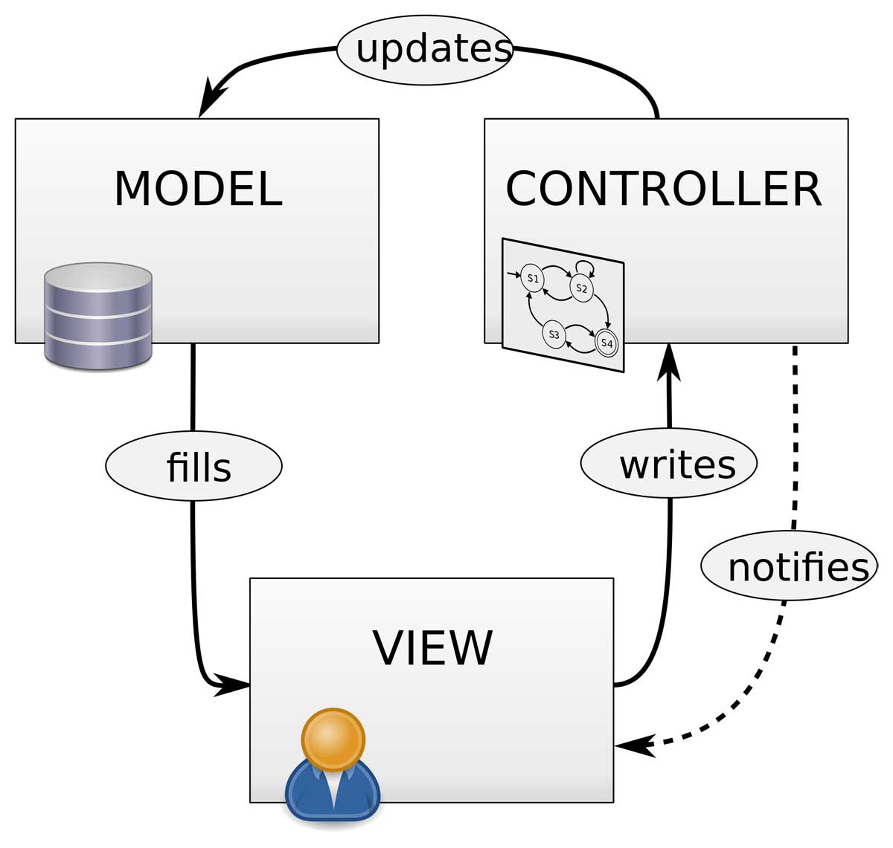

# Laporan Modul 1: Perkenalan Laravel
**Mata Kuliah:** Workshop Web Lanjut
**Nama:** Ilham Syahdienar
**NIM:** 2024573010029
**Kelas:** TI-2C

---

## Abstrak
Laporan ini berisi tentang langkah awal dalam memulai Laravel 12, adapun tujuan praktikum ini yaitu untuk mengingat dan mengulang tentang laravel

---

## 1. Pendahuluan
- Perkenalan Laravel
Bagi yang belum familiar, framework web adalah kumpulan pustaka (library) dan alat (tools) yang membantu pengembangan membangun aplikasi lebih cepat dengan menyediakan fitur fitur umum seperti: Routing, Manajemen basis data, Autentikasi (Authentication). Dan salah satu Framework yang digemari dan terkenal saat ini yaitu Laravel
- apa itu laravel?
Laravel adalah framework web PHP yang populer, bersifat open-source, dan dirancang untuk membangun aplikasi web modern yang skalabel dan aman. Laravel dibuat oleh Taylir Otwell pada tahun 2011 dan hingga kini menjadi salah satu framework PHP paling populer di dunia, Karena: Sintaks yang ekspresif dan elegan, Fitur yang lengkap dan kuat, Komunitas yang aktif
- Karakteristik utama laravel
Karakteristik utama Laravel 12 meliputi arsitektur Model-View-Controller (MVC) yang memisahkan logika, tampilan, dan data aplikasi; sifat opinionated yang menyediakan struktur dan konvensi baku untuk mempercepat pengembangan; serta berbagai peningkatan seperti keamanan yang lebih kuat, performa lebih baik, starter kits yang fleksibel
- Laravel cocok untuk aplikasi web seperti:
    - Sistem Manajemen Konten (CMS)
    - Aplikasi eCommerce Sederhana
    - Platform Blogging
    - Portal Blogging
    - Portal Lowongan Kerja

---

## 2. Komponen Utama Laravel
- Blade (templating)
    blade yaitu template tampilan bawaan yang disediakan langsung oleh laravel
- Eloquent (ORM)
    Eloquent yaitu fitur bawaan Laravel yang berfungsi sebagai ORM, ORM yaitu Object Relational Model
- Routing
    Routing yaitu mekanisme cara untuk menentukan bagaimana aplikasi merespons sebuah request dari URL tertentu, dan bisa menghubungkan URL ke Controller, atau view
- Controllers
    Controller berfungsi yang menghubungkan routes dengan logika aplikasi(code untuk mengolah data, memanggil model)
- Migrations & Seeders
    Migrations dan Seeders keduanya sama sama berhubungan dengan Database, Migrations untuk mengatur struktur database(tabel, kolom), sedangkan seeders yaitu untuk mengisi database dengan data awal atau data contoh degnan otomatis
- Artisan CLI
    Artisan CLI adalah command line interface bawaan laravel yang menyediakan berbagai perintah, seperti untuk membuat controller, model, migrations, seeder, dsb.
- Testing (PHPUnit)
    testing PHPunit  yaitu fitur untuk menguji fungsionalitas aplikasi secara otomatis agar memastikan kode berjalan sesuai harapan.

---

## 3. Penjelasan setiap folder dan file ddi struktur project Laravel

1. app/ = Berisi semua logika bisnid aplikasi, termasuk model, controller, middleware, dan layanan lainnya.
    - Console/ = Berisi perintah artisan Custom yang dapat dibuat sendiri
    - Exceptions/ = tempat untuk menangani exception custom dan error handling
    - Http/ = Folderini berisi komponen utama aplikasi seperti Controller, Middleware, dan Request
        - Controllers/ = Tempat Menyimpan semua controller
        - Middleware/ = Untuk mengatur request sebelum masuk ke aplikasi
        - Request/ = Berisi validasi request custom
    - Models/ = folder untuk menyimpan model-model yang berinteraksi dengan database
    - Providers/ = Berisi service provider untuk konfigurasi global aplikasi

2. Bootstrap/ = Folder ini berisi file yang digunakan Laravel untuk bootstrap framework dan menginisialisasi aplikasi
    - cache/ = Berisi file cache untuk meningkatkan performa aplikasi.
    - app.php = File utama yang digunakan untuk memboostrap Laravel

3. config/ = menyimpan berbagai file konfigurasi aplikasi seperti database, autentikasi, caching, sesi, dan lain-lain.
    - app.php = Konfigurasi dasar aplikasi
    - database.php = Konfigurasi database
    - mail.php = Konfigurasi email
    - queue.php = Konfigurasi antrian

4. database/ = Folder ini digunakan untuk menyimpan semua yang berkaitan dengan database
    - factories/ = Berisi factory class untuk membuat data dummy
    - migrations/ = Berisi file migrasi untuk mengelola struktur database.
    - seeders/ = Berisi seeder untuk mengisi database dengan data awal.

5. lang/ = Folder ini digunakan untuk menyimpan file terjemahan aplikasi jika ingin mendukung berbagai bahasa. File bahasa disimpan dalam format PHP atau JSON.

6. public/ = adalah root akses aplikasi melalui browser
    - index.php = Entry point utama aplikasi Laravel.
    - assets/ = Folder tempat menyimpan file statis seperti CSS, JavaScript, dan gambar.

7. resources/ = menyimpan file sumber daya aplikasi, seperti tampilan Blade, file CSS/JS, dan lain-lain.
    - views/ = Berisi file blade template untuk tampilan aplikasi
    - css/ = Berisi file CSS atau Framework seperti tailwind
    - js/ = Berisi file JavaScript khusus aplikasi

8. routes/ = Folder ini berisi semua rute (routes) aplikasi. Laravel 12 menggunakan beberapa file utama untuk mengatur routing
    - web.php = Berisi rute untuk aplikasi berbasis web
    - api.php = Berisi rute API yang tidak memerlukan sesi pengguna
    - console.php = Berisi perintah CLI kustom yang bisa dibuat dengan Artisan

9. storage/ = ini digunakan untuk menyimpan berbagai file yang diperlukan oleh aplikasi saat runtime.
    - app/ = Tempat menyimpan file yang diunggah pengguna
    - framework/ = Berisi cache dan sesi aplikasi 
    - logs/ = Menyimpan log aplikasi

10. tests/ = igunakan untuk menyimpan file uji unit dan fitur aplikasi menggunakan PHPUnit atau Laravel Dusk.

11. vendor/ = Folder ini berisi semua dependensi yang diunduh melalui Composer, termasuk Laravel itu sendiri.

12. File Konfigurasi Utama
    - .env = Berisi variaibel lingkungan aplikasi
    - composer.json = File konfigurasi untuk Composer
    - Package.json = Berisi Konfigurasi dependensi npm
    - artisan = File CLI untuk menjalankan perintah Laravel

---

## 4. DIagram MVC dan cara Kerjanya
{width=200}
Model di Laravel berfungsi mengelola data dan berinteraksi dengan database. Dengan bantuan Eloquent ORM, model memudahkan pengambilan maupun pengolahan data melalui sintaks sederhana.

View adalah bagian tampilan yang menampilkan data ke pengguna. Laravel menggunakan Blade template untuk menyusun halaman agar terpisah dari logika program sehingga lebih rapi dan mudah dikelola.

Controller menjadi penghubung antara model dan view. Controller menerima request dari route, mengambil data lewat model, lalu mengirimkannya ke view untuk ditampilkan kepada pengguna.
- Alur Kerja MVC di Laravel
    - User mengakses URL → Routing (di routes/web.php) menentukan controller mana yang dijalankan.
    - Controller dipanggil → Controller meminta data dari Model.
    - Model berkomunikasi dengan database → Mengembalikan data ke Controller.
    - Controller mengirim data tersebut ke View.
    - View menampilkan data ke browser user.

---

## 5. Kelebihan dan Kekurangan
- Kelebihan Laravel menurut saya adalah lebih mudah di pelajari dan lebih mudah untuk di implementasikan langsung, dan juga karena komunitas yang menggunakan laravel sangat banyak maka itu juga dapat membantu saat terjadi error atau bug. dan juga banyaj perusahaan besar yang menggunakan Laravel sebagai aplikasi web mereka, sedangkan kekurangannya yaitu cukup sulit di pelajari jika laravel adalah framework pertama yang dipelajari.
- tantangannya yaitu mungkin sulit atau cukup susa memahami konsep awal dari frameworknya, seperti MVC, Migrations.

---

## 7. Referensi 
- Mengenal Laravel dan Breeze Serta Fitur Unggulannya (https://buildwithangga.com/tips/mengenal-laravel-dan-breeze-serta-fitur-unggulannya#:~:text=Contoh%20Projek%20yang%20Bisa%20Dibuat,mencari%20atau%20memposting%20lowongan%20pekerjaan.)
- Struktur Folder Laravel 12: Panduan Lengkap (https://abdulrahmann.com/2025/03/06/struktur-folder-laravel-12-panduan-lengkap-4/)
- Markdown – Memasukkan Gambar (https://www.ulas.in/komputer/markdown-memasukkan-gambar/)