# Laporan Modul 2: Laravel Fundamentals
**Mata Kuliah:** Workshop Web Lanjut   
**Nama:** Ilham Syahdienar  
**NIM:** 2024573010029
**Kelas:** TI-2C

---

## Abstrak
Laporan ini berisi pembelajaran tentang MVC, yaitu Model, Views, Controller. dilaporan ini juga berisi 2 percobaan, percobaan menampilkan teks dengan routes yang dibuat sendiri, dan membuat kalkulator sederhana.

---

## 1. Dasar Teori
- Apa itu MVC?
    - MVC adalah sebuah pendekatan perangkat lunak yang memisahkan aplikasi logika dan presesentasi. Dengan komponen Model, View, Controller  kita bisa menangani pengembangan aplikasi untuk aspek-aspek tertentu
- Konsep Routing di Laravel
    - Routing di Laravel yaitu mekanisme yang menghubungkan URL atau alamat pada browser dengan logika atau fungsi tertentu di aplikasi. Istillah Sederhana dari routing yaitu seperti peta yang mengarahkan request ke tempat yang benar di aplikasi anda.
- Fungsi Middleware
    - keamanan = dapat melindungi data sensisif dan mengontrol hak akses pengguna.
    - Pemfilteran Data = untuk memanipulasi data permintaan sebelum sebuah action dalam controller
    - logging dan audit = digunakan untuk mencatat aktivitas pengguna atau melakukan audit terhadap permintaan yang masuk.
- Bagaimana cara Laravel menangani Request dan Response.
    - Ketika user mengakses sebuah URL, Laravel akan menangani request tersebut melalui serangkaian proses yang disebut lifecycle. Proses ini dimulai dari HTTP kernel, yang bertanggung jawab menginisialisasi aplikasi, hingga akhirnya menghasilkan response yang dikirimkan kembali ke browser.
        - Middleware: Bagian ini mengelola request sebelum mencapai logika utama aplikasi, seperti memeriksa autentikasi atau filtering data.
        - Routing: Setelah request melewati middleware, Laravel akan mencocokkan URL yang diminta dengan route yang telah didefinisikan.
        - Controller dan Views: Laravel kemudian memproses logika di controller, mengakses data dari model jika diperlukan, lalu mengirimkan hasilnya melalui view kepada browser.
- Peran Controller dan View
    - peran Controller ada sebagai tempat memproses atau mengeksekusi logika yang diperlukan sedangkan View sebagai tempat untuk menampilkan hasil yang sudah di eksekusi oleh controller kepada user.
- Fungsi Blade Tempalting Engine
    - berfungsi untuk menyederhanakan proses pembuatan tampilan (view) web yang dinamis, rapi, dan aman, dengan cara memisahkan logika PHP dari HTML melalui sintaks yang singkat dan fitur fitur otomatis yang membantu produktivitas pengembang.

---

## 2. Langkah-Langkah Praktikum
- 2.1 Praktikum 1 - Route, Controller, dan Blade View
    - 1. Buka project yang telah dibuat pada pertemuan sebelumnya menggunakan vscode.
    - 2. Cari file web.php pada folder routes, lalu edit kode program di dalam file web.php seperti gambar di bawah ini:
    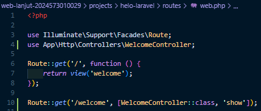
    - 3. Selanjutnya kita buat controller di terminal/git bash, untuk membuat controller kita dapat gunakan perintah: `php artisan make:controller WelcomeController`
    - 4. Setelah itu buka file controller yang telah dibuat, lalu edit kode program di file tersebut seperti gambar dibawah ini:
    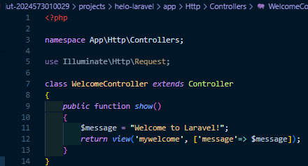
    - 5. Di `resources/views` buat file baru dengan nama `mywelcome.blade.php`, lalu isi file tersebut dengan kode program seperti gambar di bawah ini:
    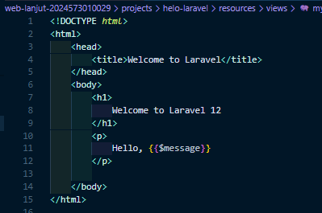
    - 6. Jalankan project laravel yang kita buat dengan mengetik `php artisan serve` diterminal atau git bash
    - 7. Buka browser lalu ketik `http:localhost:8000/welcome`, maka nanti akan keluar hasil yang sudah kita coba seperti gambar dibawah ini:
    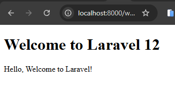

---

- 2.2 Praktikum 2 – Membuat Aplikasi Sederhana "Calculator"
    - 1. Buat sebuah project baru di dalam folder `projects` dan beri nama project baru itu adalah `calculator`
    - 2. Cari file web.php pada folder routes, lalu edit kode program di dalam file web.php seperti gambar di bawah ini:
    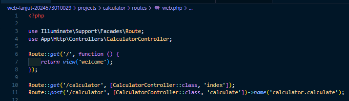
    - 3. Selanjutnya kita buat controller di terminal/git bash, untuk membuat controller kita dapat gunakan perintah: `php artisan make:controller CalculatorController`
    - 4. Lalu pada file controller yang sudah dibuat, edit kode program seperti gambar dibawah ini:
    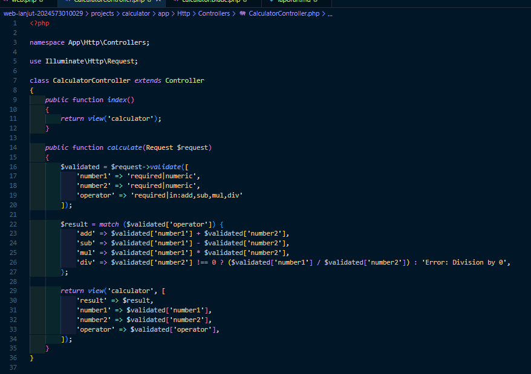
    - 5. Jangan lupa untuk membuat file baru di folder `resources/views` dengan nama `calculator.blade.php`, dan isi file tersebut dengan kode program pada gambar dibawah ini:
    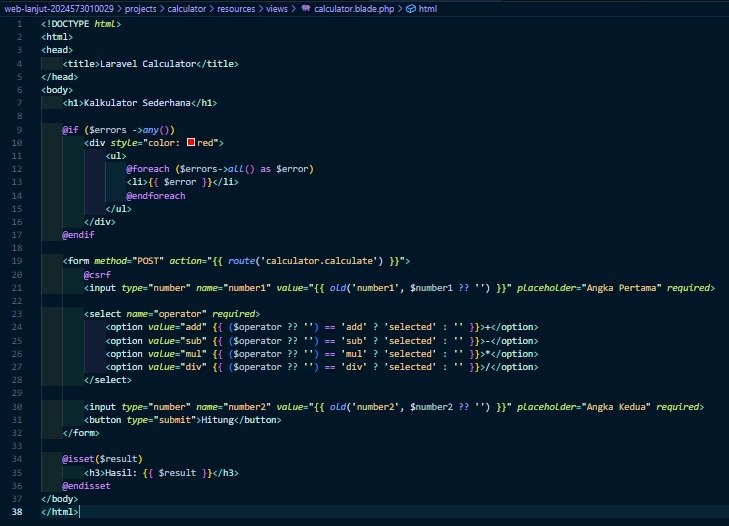
    - 6. Setelah melakukan langkah 1 hingga 5, maka pada langkah terakhir yaitu menjalankan server laravel dengan perintah `php artisan serve`, setelah itu buka browser dan akan keluar tampilan seperti gambar dibawah ini:
    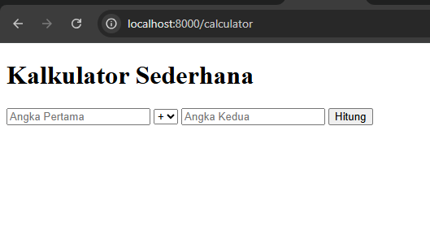

---

## 3. Hasil dan Pembahasan
- Apakah aplikasi berjalan sesuai harapan?
    - Alhamdulillah hasil dari praktikum ini sesuai harapan meskipun menjumpai beberapa error yang disebabkan karena terlalu terburu-buru sehingga beberapa kali typo.
- Apa yang terjadi jika ada input yang salah (misalnya pembagian dengan 0)?
    - yang terjadi adalah akan muncul tampilan error yang telah kita atur sesuai dengan logika pada controller, dan tampilan yang telah kita atur pada view. seperti gambar dibawah ini:
    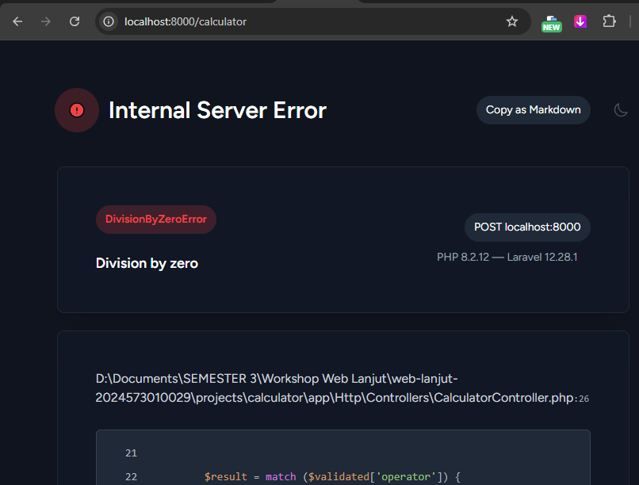
- Bagaimana validasi input bekerja di Laravel?
    - Validasi yaitu proses memeriksa data yang dikirim dari form atau request agar sesuai dengan aturan (rules) sebelum disimpan atau diproses lebih lanjut. pada praktikum ini, validasi di lakukan di file `CalculatorController`, setelah sesuai dengan aturan maka akan di eksekusi dan diproses.
- Apa peran masing-masing komponen (Route, Controller, View) dalam program yang dibuat?
    - Route = Berperan sebagai tempat untuk pengalamatan yang akan ditampilkan ke user
    - Controller = Beperan sebagai pengatur logika atau validasi yang digunakan saat request dan respon ke user.
    - View = Berperan bekerja sama dengan controller, yaitu saat controller meminta request dari user lalu melakukan validasi atau eksekusi program maka setelah itu akan ditampilkan hasil eksekusi yang dilakukan. dan tugas yang mengatur tampilan atau menyajikan tampilan data tersebut adalah view.
- Hasil Penjumlahan:
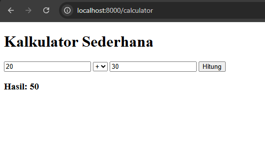
---
- Hasil Pengurangan:
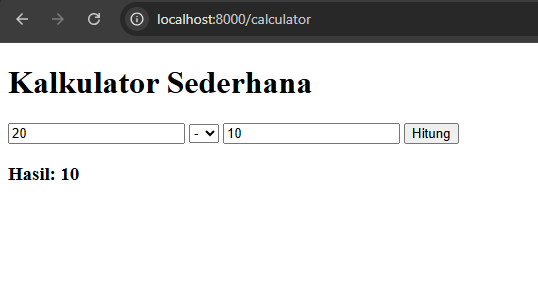
---
- Hasil Perkalian:
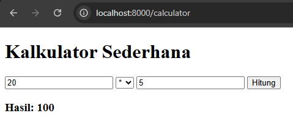
---
- Hasil Pembagian:
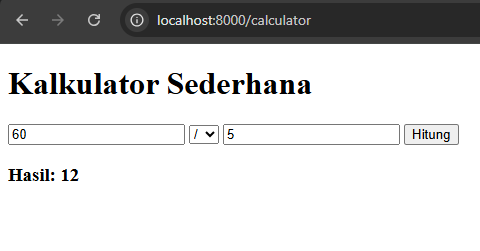

---

## 4. Kesimpulan
- Kesimpulan dari praktikum ini adalah dengan menerapkan MVC pada project yang kita buat itu akan memudahkan kita untuk pengembangan, perbaikan, dan efisiensi yang sangat berguna baik itu dalam hemat tenaga ataupun hemat waktu.

---

## 5. Referensi
- https://codingstudio.id/blog/model-view-controller-adalah/
- https://buildwithangga.com/tips/apa-itu-route-pada-framework-laravel
- https://buildwithangga.com/tips/apa-itu-laravel-request-lifecycle
- https://hackmd.io/@mohdrzu/B1zwKEK5xe