# Laporan Modul 2: Laravel Controller
**Mata Kuliah:** Workshop Web Lanjut   
**Nama:** Ilham Syahdienar  
**NIM:** 2024573010029
**Kelas:** TI-2C

---

## Abstrak
Laporan ini berisi pemahaman tentang controller pada laravel, yaitu bagian menerima permintaan dari rute, memproses input (tempat logic), dan mengembalikkan respons ke user.

---

## 1. Dasar Teori
- Apa itu Controller?
    - Controller adalah salah satu komponen inti dari MVC(Model, View, Controller) yang berfungsi sebagai penghubung antara user (View) ke model yang nantinya akan di kembalikan lagi ke View dalam bentuk response. Controller ini akan banyak berisi logika – logika dalam menyusun suatu fungsi tertentu. Contohnya adalah aktivitas CRUD (Create, Read, Update, Delete) yang prosesnya berjalan di dalam Controller.
    - Perintah artisan untuk membuat controller yaitu
        - `php artisan make:controller PageController`
    - Untuk menggunakan Controller tersebut maka kita perlu mendaftarkannya di dalam file route:
        - `use App\Http\Controllers\PageController;`
        `Route::get('/home', [PageController::class, 'home']);`

- Jenis - jenis Controller
    - Resource Controller
        - Resource dirancang berguna untuk jika ingin menggunakan operasi CRUD secara efisien, dimana laravel akan menyediakan metode bawaan seperti index, create, store, show, edit, update, dan destroy yang bisa langsung digunakan
    - Invokable Controller
        - Invokable controller cocok untuk tugas yang hanya membutuhkan satu metode, contohnya seperti menghitung total diskon atau mengirim email.
    - Nested Controller
        - Nested Controlller digunakan untuk mengelola relasi antar entitas, seperti review untuk setiap buah.
    - Custom Controller
        - Controller ini digunakan untuk kebutuhan khusus, seperti menampilkan penawaran spesial.

---

## 2. Langkah-Langkah Praktikum
- 2.1 Praktikum 1 - Menangani Request dan Response View di Laravel 12
    - 1. Buat project baru di dalam folder projects dengan nama lab-view, buat dengan perintah composer seperti ini:   
        - `composer create-project laravel/laravel lab-view`
    - 2. Selanjutnya kita buat controller di terminal/git bash, dengan nama controllernya adalah WelcomeController. Untuk membuat controller kita dapat gunakan perintah: 
        - `php artisan make:controller WelcomeController`
    - 3. Setelah itu buka file controller yang telah dibuat di app/http/controller/WelcomeController, lalu edit kode program di file tersebut seperti gambar dibawah ini:
    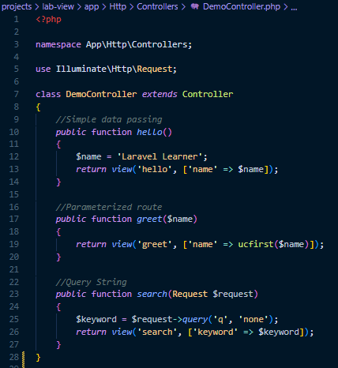
    - 4. selanjutnya kita akan mendefinisakn rute, dengan cara cari file web.php pada folder routes, lalu edit kode program di dalam file web.php seperti gambar di bawah ini:
    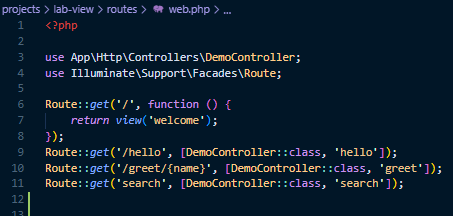
    - 5. Di `resources/views` kita akan membuat 3 file blade untuk view yang sederhana. beri nama file tersebut adalah:
        - hello.blade.php
        - greet.blade.php
        - search.blade.php
    - 6. selanjutnya kita akan mengedit atau menambahkan kode program di masing masing file blade.
    - hello.blade.php
        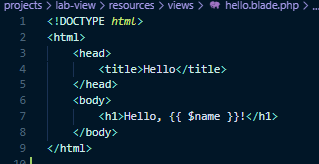
    - greet.blade.php
        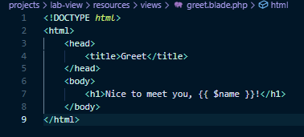
    - search.blade.php
        

    - 7. Setelah melakukan langkah 1 hingga 6, maka pada langkah terakhir yaitu menjalankan server laravel dengan perintah `php artisan serve`.
    - 8. Buka browser lalu ketik kunjungi url url ini
        - `http://127.0.0.1:8000/hello`, maka nanti akan keluar hasil yang sudah kita coba seperti gambar dibawah ini:
        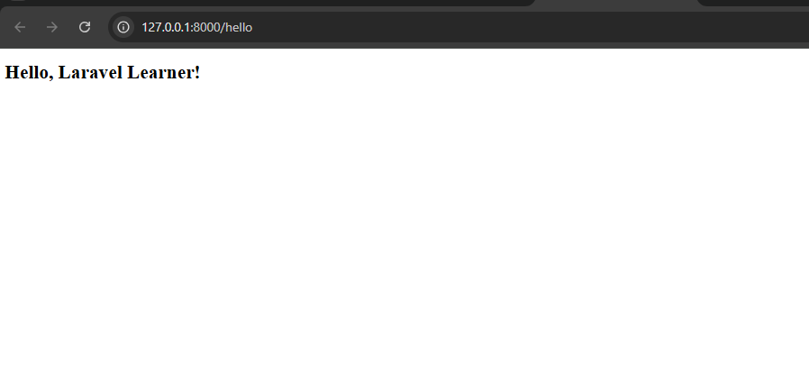
        - `http://127.0.0.1:8000/greet/ilham`, maka nanti akan keluar hasil yang sudah kita coba seperti gambar dibawah ini:
        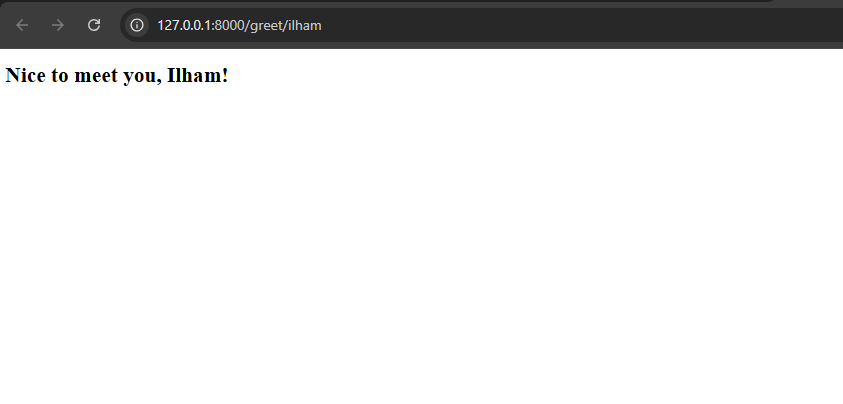
        - `http://127.0.0.1:8000/search?q=laravel`, maka nanti akan keluar hasil yang sudah kita coba seperti gambar dibawah ini:
        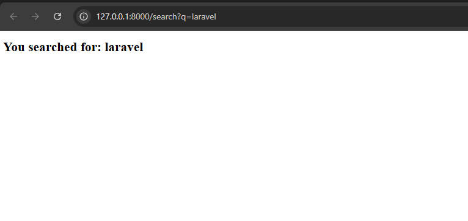

---

- 2.2 Praktikum 2 – Menggunakan Group Route
    - 1. Buat project baru di dalam folder projects dengan nama lab-group, buat dengan perintah composer seperti ini:   
        - `composer create-project laravel/laravel lab-group`
    - 2. Selanjutnya kita buat controller di terminal/git bash, dengan nama controllernya adalah PageController. Untuk membuat controller kita dapat gunakan perintah: 
        - `php artisan make:controller PageController`
    - 3. Setelah itu buka file controller yang telah dibuat di app/http/controller/PageController, lalu edit kode program di file tersebut seperti gambar dibawah ini:
    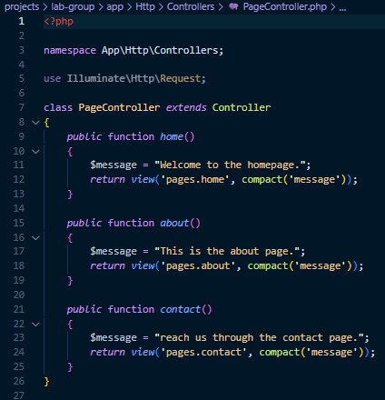
    - 4. selanjutnya kita akan mendefinisakn rute yang dikelompokkan, dengan cara cari file web.php pada folder routes, lalu edit kode program di dalam file web.php seperti gambar di bawah ini:
    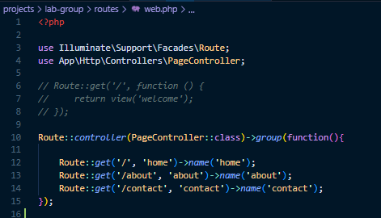
    - 5. Di `resources/views` buat folder baru bernama `pages` lalu kita akan membuat 3 file blade untuk view yang sederhana. beri nama file tersebut adalah:
        - about.blade.php
        - contact.blade.php
        - home.blade.php
    - 6. selanjutnya kita akan mengedit atau menambahkan kode program di masing masing file blade.
    - about.blade.php
        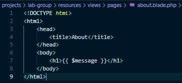
    - contact.blade.php
        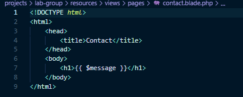
    - home.blade.php
        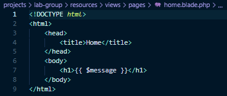

    - 7. Setelah melakukan langkah 1 hingga 6, maka pada langkah terakhir yaitu menjalankan server laravel dengan perintah `php artisan serve`.
    - 8. Buka browser lalu ketik kunjungi url url ini
        - `http://127.0.0.1:8000/`, maka nanti akan keluar hasil yang sudah kita coba seperti gambar dibawah ini:
        
        - `http://127.0.0.1:8000/about`, maka nanti akan keluar hasil yang sudah kita coba seperti gambar dibawah ini:
        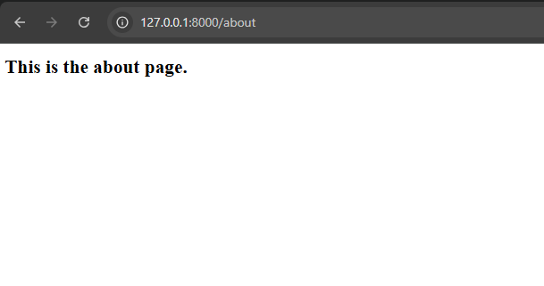
        - `http://127.0.0.1:8000/contact`, maka nanti akan keluar hasil yang sudah kita coba seperti gambar dibawah ini:
        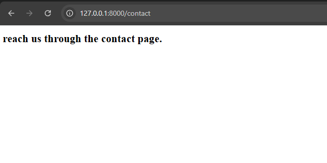

---

- 2.3 Praktikum 3 – Pengelompokan Prefix dengan Namespace Rute di Laravel 12
    - 1. Buat project baru di dalam folder projects dengan nama lab-prefix, buat dengan perintah composer seperti ini:   
        - `composer create-project laravel/laravel lab-prefix`
    - 2. Selanjutnya kita buat folder admin Ini akan membuat dua controller di direktori app/Http/Controllers/, dengan nama controllernya adalah UserController dan AdminController. Untuk membuat controllernya kita dapat gunakan perintah: 
        - `php artisan make:controller Admin/UserController`
        - `php artisan make:controller Admin/DashboardController`
    
    - 3. Setelah itu buka file controller yang telah dibuat di `app/http/controller/Admin`, lalu edit kode program di file tersebut seperti gambar dibawah ini:
    - UserController
    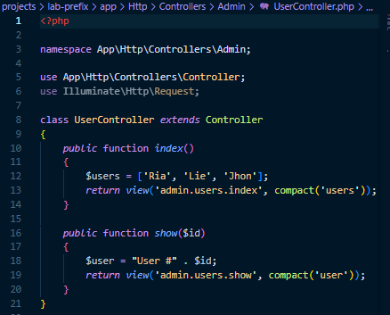
    - DashboardController
    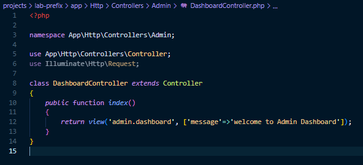
    - 4. selanjutnya kita akan mendefinisakn rute yang dikelompokkan dengan prefix dan namespace controller, dengan cara cari file web.php pada folder routes, lalu edit kode program di dalam file web.php seperti gambar di bawah ini:
    
    - 5. Di `resources/views` buat folder baru bernama `admin` lalu di folder `admin` kita akan membuat 1 file blade dan 1 folder `users` untuk view yang sederhana. beri nama file `dashboard.blade.php` di folder admin, dan isikan kode ini:
    - 
    - 6. Di `resources/views/Admin/users` buat2 file yaitu:
        - `index.blade.php` dan isikan kode berikut:
        - 
        - `show.blade.php`
        - 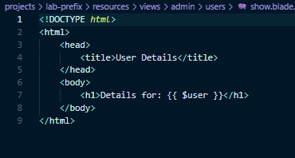
    - 7. Setelah melakukan langkah 1 hingga 6, maka pada langkah terakhir yaitu menjalankan server laravel dengan perintah `php artisan serve`.
    - 8. Buka browser lalu ketik kunjungi url url ini
        - `http://127.0.0.1:8000/admin/dashboard`, maka nanti akan keluar hasil yang sudah kita coba seperti gambar dibawah ini:
        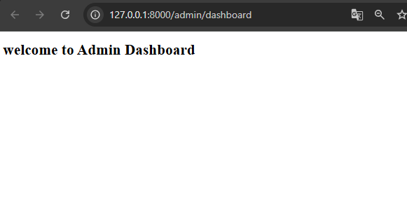
        - `http://127.0.0.1:8000/admin/users`, maka nanti akan keluar hasil yang sudah kita coba seperti gambar dibawah ini:
        
        - `http://127.0.0.1:8000/admin/users/2`, maka nanti akan keluar hasil yang sudah kita coba seperti gambar dibawah ini:
        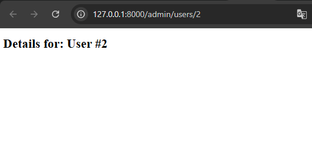

---

## 3. Hasil dan Pembahasan
- Apakah aplikasi berjalan sesuai harapan?
    - Alhamdulillah hasil dari praktikum ini sesuai harapan meskipun menjumpai beberapa error yang disebabkan karena terlalu terburu-buru sehingga beberapa kali typo.
- Bagaimana pengelompokan rute di Laravel 12 bekerja?
    - Pengelompokan rute di Laravel 12 itu fungsinya supaya rute yang mirip-mirip bisa digabung jadi satu. Misalnya semua rute admin pakai prefix /admin dan middleware auth, jadi nggak perlu nulis berulang. Cukup pakai Route::prefix('admin')->middleware('auth')->group(function () { ... });, nanti semua rute di dalamnya otomatis ikut aturan itu. Intinya, biar kode lebih rapi, gampang diatur, dan nggak ribet kalau mau ubah prefix.
- Apa itu prefix?
    - Prefix itu kayak tambahan di depan URL yang dipakai bareng-bareng beberapa rute. Misalnya kamu bikin prefix('admin'), berarti semua rute di dalam grup itu URL-nya bakal diawali /admin, contohnya pada praktikum ini yaitu di praktikum 3 yaitu `http://127.0.0.1:8000/admin/users/2`, yang prefix itu bagian `admin`.

## 4. Kesimpulan
- Kesimpulan dari praktikum ini adalahtentang cara kerja controller di Laravel 12, mulai dari pembuatan, pengelolaan rute, pengiriman data ke view, jenis jenis controller, hingga validasi dan respons. Melalui pembahasan dan praktik yang dilakukan, kita belajar bagaimana mengatur struktur aplikasi agar lebih rapi dan efisien, serta mempelajari cara mengelompokkan rute untuk organisasi yang lebih baik. yang nantinya menjadi bekal penting untuk mempelajari fitur Laravel yang lebih kompleks di bab selanjutnya.

---

## 5. Referensi
- https://buildwithangga.com/tips/apa-itu-controller-pada-laravel
- https://informatika.ciputra.ac.id/2019/10/laravel-controller/
- https://hackmd.io/@mohdrzu/H1sB73dnxg
