# Laporan Modul 2: Laravel Blade Template Engine
**Mata Kuliah:** Workshop Web Lanjut   
**Nama:** Ilham Syahdienar  
**NIM:** 2024573010029
**Kelas:** TI-2C

---

## Abstrak
Laporan ini membahas Laravel Blade Template Engine, yaitu mesin templating bawaan Laravel yang memudahkan pembuatan tampilan web yang dinamis dan efisien. Blade mendukung berbagai fitur seperti inheritance layout, komponen reusable, direktif kontrol alur, dan integrasi data dari controller. Dengan Blade, pengembang dapat memisahkan logika dan tampilan secara terstruktur sehingga pengembangan aplikasi web menjadi lebih cepat dan mudah dikelola.

---

## 1. Dasar Teori
- Apa itu Blade?
    - Blade adalah mesin templating laravel yang powerful dan sederhana, yang memungkinkan untuk menulis template yang bersih dan mudah dibaca menggunakan PHP biasa dengan shortcut yang membantu
        - Fitur Utama di blade:
            -> Ringan dan cepat
            -> Mendukung inheritance dan components
            -> menyertakan struktur kontrol
- Layouts dan Sections
    - Blade memungkinkan kita untuk membuat layout dan section untuk mengatur view yang lebih baik. Ini berguna untuk membuat tampilan yang konsisten di seluruh aplikasi Anda.
    - Kita juga dapat membuat child view yang mewarisi layout dengan  code program seperti dibawah ini di child view paling atas
        - `@extends('layouts.app')`
- Blade Components
    - Blade Components adalah semacam “template mini” yang bisa kamu pakai ulang di mana aja. Misalnya, kamu punya tombol dengan style tertentu yang dipakai berkali-kali di banyak halaman. Daripada nulis ulang HTML-nya terus, mending dibikin component aja.
- Perulangan dan Kondisional Blade
    - @isset -> mengecek apakah variabel ada.
    - @empty -> mengecek apakah variabel ada.
    - @isset -> mengecek apakah variabel kosong.
    - @switch, @case, @default -> alternatif untuk banyak kondisi
- Menampilkan Error Validasi
    - Saat menggunakan form, kita dapat menampilkan error validasi di view Blade Anda. Laravel secara otomatis mengikat pesan error ke variabel $errors

---

## 2. Langkah-Langkah Praktikum
- ##### 2.1 Praktikum 1 - Meneruskan Data dari Controller ke Blade View
    - 1. Buat project baru dengan nama modul-4-blade-view di folder projects tempat menyimpan folder folder project pada pertemuan sebelumnya menggunakan vscode, buka git bash, dan masuk ke direktori projects:
        - `composer create-project laravel/laravel modul-4-blade-view`
        - masuk ke direktori modul-4-blade-view
    - 2. Buat Controller dengan nama controller:
        - `php artisan make:controller DasarBladeController`
    - 3. Setelah membuat controller, selanjutnya definisikan route nya di routes/web.php, tambahkan seperti ini:
        - `use App\Http\Controllers\DasarBladeController;`
        `Route::get('/dasar', [DasarBladeController::class, 'showData']);`
    - 4. Selanjutnya kita akan buat metode untuk menghandle data pada controller dengan cara masuk ke app/Http/Controllers/DasarBladeController.php lalu tambahkan code berikut:
    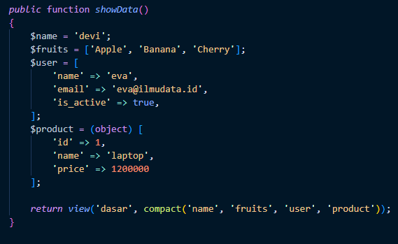
    - 5. Di `resources/views` buat file baru dengan nama `dasar.blade.php`, lalu isi file tersebut dengan kode program seperti gambar di bawah ini:
    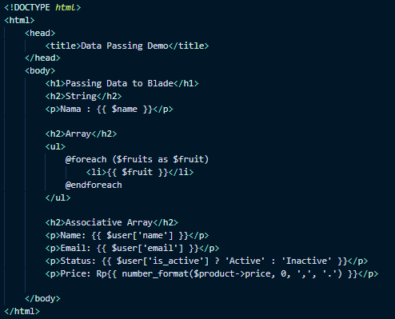
    - 6. Jalankan project laravel yang kita buat dengan mengetik `php artisan serve` diterminal atau git bash
    - 7. Buka browser lalu ketik `http:localhost:8000/dasar`, maka nanti akan keluar hasil yang sudah kita coba seperti gambar dibawah ini:
    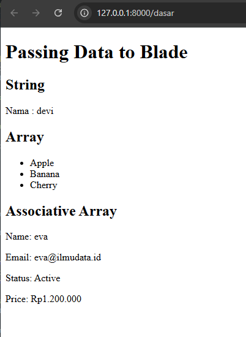

---

- ##### 2.2 Praktikum 2 – Menggunakan Struktur Kontrol Blade
    - 1. Buka project yang sudah dibuat pada praktikum sebelumnya, yaitu modul-4-blade-view
    - 2. Selanjutnya kita buat controller baru, dengan nama LogicController, untuk membuat controller tersebut kita dapat gunakan perintah: 
        - `php artisan make:controller LogicController`
    - 3. Selanjutnya kita tambahkan route LogicController di routes/web.php, ikuti seperti gambar dibawah ini:  
        - `use App\Http\Controllers\LogicController;`
    `Route::get('/logic', [LogicController::class, 'show']);`
    - 4. Lalu pada file controller yang sudah dibuat, edit kode program seperti gambar dibawah ini:
    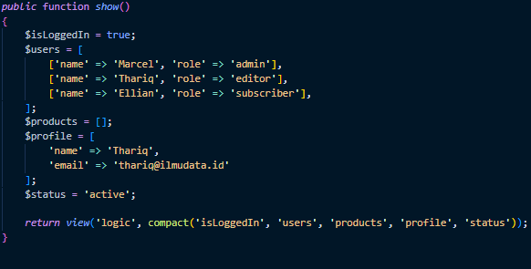
    - 5. Setelah mengedit controller, kita buat file baru di folder `resources/views` dengan nama `logic.blade.php`, dan isi file tersebut dengan kode program pada dibawah ini:
        ```blade
        <!DOCTYPE html>
        <html>
            <head>
                <title>Blade Logic Demo</title>
            </head>
            <body>
                <h1>Blade Control Structures Demo</h1>
                <h2>1. @@if / @@else</h2>
                @if ($isLoggedIn)
                    <p>Welcome back, user!</p>
                @else
                    <p>Please log in</p>
                @endif

                <h2>2. @@foreach</h2>
                <ul>
                    @foreach ($users as $user)
                        <li>{{ $user['name'] }} - Role: {{ $user['role'] }}</li>
                    @endforeach
                </ul>

                <h2>3. @@forelse</h2>
                @forelse ($products as $product)
                    <p>{{ $product }}</p>
                @empty
                    <p>No products found</p>
                @endforelse

                <h2>4. @@isset</h2>
                @isset($profile['email'])
                    <p>User Email: {{ $profile['email'] }}</p>
                @endisset

                <h2>5. @@empty</h2>
                @empty($profile['phone'])
                    <p>No phone number available.</p>
                @endempty

                <h2>6. @@switch</h2>
                @switch($status)
                    @case('active')
                        <p>Status: Active</p>
                        @break
                    @case('inactive')
                        <p>Status: Inactive</p>
                        @break
                    @default
                        <p>Status: Unknown</p>
                @endswitch
            </body>
        </html>
     
    - 6. Setelah melakukan langkah a hingga e, kita akan melihat halaman yang mendemonstrasikan berbagai struktur kontrol Blade yang beraksi. maka pada langkah terakhir yaitu menjalankan server laravel dengan perintah `php artisan serve`, masuk ke `http://127.0.0.1:8000/logic`, setelah itu buka browser dan akan keluar tampilan seperti gambar dibawah ini:
    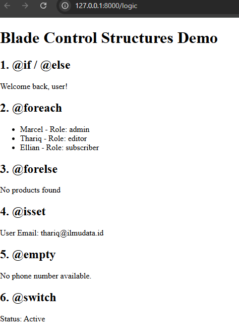

---

- ##### 2.3 Praktikum 3 – Layout dan Personalisasi di Laravel 12 dengan Bootstrap
    - 1. Buka project yang sudah dibuat pada praktikum sebelumnya, yaitu modul-4-blade-view
    - 2. Selanjutnya kita buat controller baru, dengan nama PageController, untuk membuat controller tersebut kita dapat gunakan perintah: 
        - `php artisan make:controller PageController`
    - 3. Selanjutnya kita tambahkan route PageController di routes/web.php, ikuti seperti gambar dibawah ini:  
        - `use App\Http\Controllers\PageController;`
        `Route::get('/admin', [PageController::class, 'admin']);`
        `Route::get('/user', [PageController::class, 'user']);`
        - Ini akan membuat dua rute: `/admin dan /user`, yang akan ditangani oleh metode admin dan user di PageController, masing-masing.
    - 4. Lalu pada file controller yang sudah dibuat yaitu PageController, tambahkan logika yang mencakup penerusan peran pengguna dan nama pengguana ke view dengan kode program seperti gambar dibawah ini:
    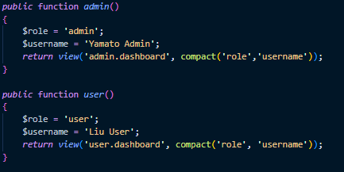
    - 5. Setelah mengedit controller, kita buat file layout dasar dengan bootstrap baru di folder `resources/views` buat direktori baru yaitu `layouts` lalu di dalam `layouts` isi dengan file `app.blade.php`, dan isi file tersebut dengan kode program pada dibawah ini:
        ```blade
        <!DOCTYPE html>
        <html>
            <head>
                <title>@yield('tittle') | Layout and Personalization</title>
                <link href="https://cdn.jsdelivr.net/npm/bootstrap@5.3.3/dist/css/bootstrap.min.css" rel="stylesheet">
            </head>
            <body>
                <nav class="navbar navbar-expand-lg navbar-dark bg-dark mb-4">
                    <div class="container">
                        <a class="navbar-brand" href="#">Layout and Personalization</a>
                        <div class="collapse navbar-collapse">
                            <ul class="navbar-nav ms-auto">
                                <li class="nav-item">
                                    <span class="nav-link active">Welcome, {{ $username }}</span>
                                </li>
                            </ul>
                        </div>
                    </div>
                </nav>

                <div class="container">
                    @if ($role === 'admin')
                        <div class="alert alert-info">Admin Access Granted</div>
                    @elseif ($role === 'user')
                        <div class="alert alert-success"> User Area</div>
                    @endif

                    @yield('content')
                </div>

                <footer class="bg-light text-center mt-5 p-3 border-top">
                    <p class="mb-0">$copy; 2025 Layout and Personalization. All right reserved.</p>
                </footer>

                <script src="https://cdn.jsdelivr.net/npm/bootstrap@5.3.0/dist/js/bootstrap.bundle.min.js"></script>
            </body>
        </html>
     
    - 6. Setelah membuat layout dasar, selanjutnya kita membuat view untuk dashboard admin, dengan buat direktori `admin` di `resources/views` lalu buat file `dahsboard.blade.php` , pada file ini akan mewarisi layout dasar sebelumnya yaitu `app.blade.php`, isi dengan kode program dibawah ini:
    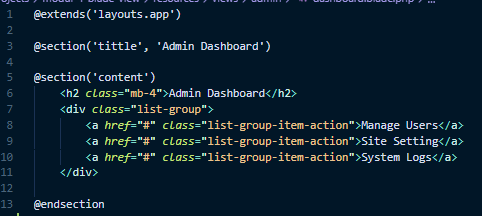

    - 7. Setelah membuat view dashboard untuk admin, selanjutnya kita membuat view untuk dashboard pengguna, dengan buat direktori `user` di `resources/views` lalu buat file `dahsboard.blade.php` , pada file ini akan mewarisi layout dasar sebelumnya yaitu `app.blade.php`, isi dengan kode program dibawah ini:
    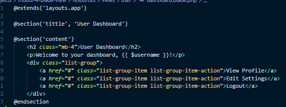

    - 6. Setelah melakukan langkah a hingga g, kita akan melihat dashboard admin dan pengguna dengan pesan yang dipersonalisasi dan alert spesifik sesuai dengan peran masing-masing. maka pada langkah terakhir yaitu menjalankan server laravel dengan perintah `php artisan serve`, masuk ke `http://127.0.0.1:8000/logic`, setelah itu buka browser dan akan keluar tampilan seperti gambar dibawah ini:
        - admin 
        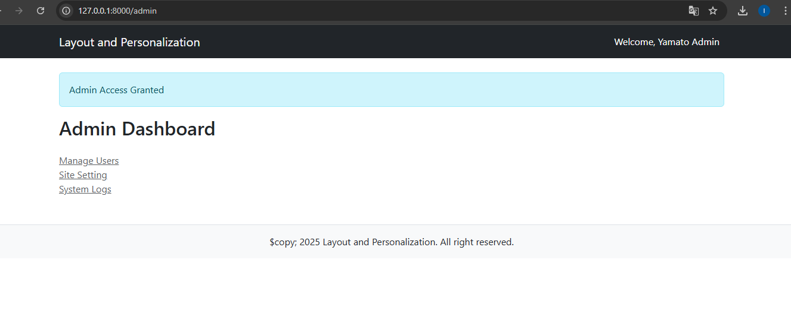
        - user 
        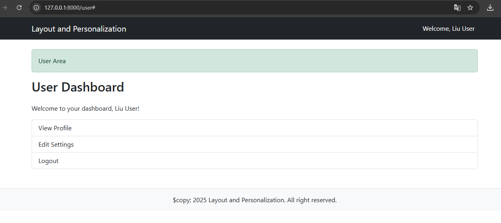

---    

- ##### 2.4 Praktikum 4 - Partial Views, Blade Components, dan Theme Switching di Laravel 12
    - 1. Buat project baru dengan nama modul-4-laravel-ui di folder projects tempat menyimpan folder folder project pada pertemuan sebelumnya menggunakan vscode, buka git bash, dan masuk ke direktori projects, lalu perintah untuk membuat project baru:
        - `composer create-project laravel/laravel modul-4-laravel-ui`
        - masuk ke direktori modul-4-laravel-ui
    - 2. Buat Controller dengan nama controller:
        - `php artisan make:controller UIController`
    - 3. Setelah membuat controller, selanjutnya definisikan route nya di routes/web.php, tambahkan seperti ini:
        - `use App\Http\Controllers\UIController;`
        `Route::get('/', [UIController::class, 'home'])->name('home');`
        `Route::get('/about', [UIController::class, 'about'])->name('about');`
        `Route::get('/contact', [UIController::class, 'contact'])->name('contact');`
        `Route::get('/profile', [UIController::class, 'home'])->name('profile');`
        `Route::get('/switch-theme/{theme}', [UIController::class, 'switchTheme'])->name('switch-theme');`
    - 4. Selanjutnya kita akan mengupdate data pada controller dengan cara masuk ke app/Http/Controllers/UIController.php lalu tambahkan code berikut:
        ```blade
            <?php

            namespace App\Http\Controllers;

            use Illuminate\Http\Request;

            class UIController extends Controller
            {
                public function home(Request $request)
                {
                    $theme = session('theme', 'light');
                    $alertMessage = 'Selamat datang di Laravel UI';
                    $features = [
                        'Partial Views',
                        'Blade Components',
                        'Theme Switching',
                        'Bootstrap 5',
                        'Responsive Design'
                    ];
                    return view('home', compact('theme', 'alertMessage', 'features'));
                }

                public function about(Request $request)
                {
                    $theme = session('theme', 'light');
                    $alertMessage = 'Halaman ini menggunakan Partials Views!';
                    $team = [
                        ['name' => 'Ilham', 'role' => 'Developer'],
                        ['name' => 'Budi', 'role' => 'Frontend Engineer'],
                        ['name' => 'Rafa', 'role' => 'Senior Engineer']
                    ];
                    return view('about', compact('theme', 'alertMessage', 'team'));
                }

                public function contact(Request $request)
                {
                    $theme = session('theme', 'light');
                    $departments = [
                        'Technical Support',
                        'Sales',
                        'Billing',
                        'General Inquiry'
                    ];
                    return view('contact', compact('theme', 'departments'));
                }

                public function profile(Request $request)
                {
                    $theme = session('theme', 'light');
                    $user = [
                        'name' => 'john doe',
                        'email' => 'john.doe@example.com',
                        'join_date' => '2024-05-20',
                        'preferences' => ['Email Notificarions', 'Dark Mode', 'Newsletter']
                    ];
                    return view('profile', compact('theme', 'user'));
                }

                public function switchTheme($theme, Request $request)
                {
                    if (in_array($theme, ['light', 'dark'])) {
                        session(['theme' => $theme]);
                    }
                    return back();
                }
            }

    - 5. Di `resources/views` buat direktori baru dengan nama `layouts`, lalu di direktori tersebut buat file dengan nama `app.blade.php`, masukkan kode program seperti di bawah ini:
        ```blade
        <!DOCTYPE html>
        <html lang="id" data-bs-theme="{{ $theme }}">
        <head>
            <meta charset="UTF-8">
            <meta name="viewport" content="width=device-width, initial-scale=1.0">
            <title>@yield('tittle', 'Laravel UI Integrated Demo')</title>
            <link href="https://cdn.jsdelivr.net/npm/bootstrap@5.3.3/dist/css/bootstrap.min.css" rel="stylesheet">
            <style>
                body {
                    padding-top: 4rem;
                    transition: all 0.3s ease;
                    min-height: 100vh;
                }

                .theme-demo {
                    border-radius: 10px;
                    padding: 20px;
                    margin: 10px 0;
                    transition: all 0.3s ease;
                }

                .feature-card {
                    transition: transform 0.2s ease;
                }

                .feature-card:hover {
                    transform: translateY(-5px);
                }
            </style>
        </head>
        <body class="{{ $theme === 'dark' ? "bg-dark text-light" : 'bg-light text-dark' }}">
            
            {{-- navigasi dengan partial view --}}
            @include('partials.navigation')

            <div class="container mt-4">
                {{-- alert dengan partial view --}}
                @if(@isset($alertMessage) && !empty($alertMessage))
                    @include('partials.alert', ['message' => $alertMessage, 'type' => 'info'])
                @endif

                @yield('content')
            </div>

            {{-- Footer menggunakan Blade Component --}}
            <x-footer :theme="$theme" />

            <script src="https://cdn.jsdelivr.net/npm/bootstrap@5.3.3/dist/js/bootstrap.bundle.min.js"></script>
            <script>
                // Smooth theme transition
                document.addEventListener('DOMContentLoaded', function() {
                    const themeLinks = document.querySelectorAll('a[href*="switch-theme"]');
                    themeLinks.forEach(link => {
                        link.addEventListener('click', function(e) {
                            e.preventDefault();
                            window.location.href = this.href;
                        });
                    });
                });
            </script>
        </body>
        </html>

    - 6. Di `resources/views` buat direktori baru dengan nama `partials`, lalu di direktori tersebut buat file dengan nama `navigation.blade.php`, masukkan kode program seperti di bawah ini:
    ```blade
    <nav class="navbar navbar-expand-lg {{ $theme === 'dark' ? 'navbar-dark bg-dark' : 'navbar-light bg-light' }} fixed-top shadow">
        <div class="Container">
            <a class="navbar-brand fw-bold" href="{{ route('home') }}">
                Laravel UI Demo
            </a>

            <button class="navbar-toggler" type="button" data-bs-toggle="collapse" data-bs-target="#navbarNav">
                <span class="navbar-toggler-icon"></span>
            </button>

            <div class="collapse navbar-collapse" id="navbarNav">
                <ul class="navbar-nav me-auto">
                    <li class="nav-item">
                        <a class="nav-link {{ request()->routeIs('home') ? 'active' : '' }}" href="{{ route('home') }}">Home</a>
                    </li>
                    <li class="nav-item">
                        <a class="nav-link {{ request()->routeIs('about') ? 'active' : '' }}" href="{{ route('about') }}">About</a>
                    </li>
                    <li class="nav-item">
                        <a class="nav-link {{ request()->routeIs('contact') ? 'active' : '' }}" href="{{ route('contact') }}">Contact</a>
                    </li>
                    <li class="nav-item">
                        <a class="nav-link {{ request()->routeIs('profile') ? 'active' : '' }}" href="{{ route('profile') }}">Profile</a>
                    </li>
                </ul>

                <ul class="navbar-nav">
                    <li class="nav-item dropdown">
                        <a class="nav-link dropdown-toggle" href="#" role="button" data-bs-toggle="dropdown">
                            Theme: {{ ucfirst($theme) }}
                        </a>
                        <ul class="dropdown-menu">
                            <li><a class="dropdown-item" href="{{ route('switch-theme', 'light') }}">Mode terang</a></li>
                            <li><a class="dropdown-item" href="{{ route('switch-theme', 'dark') }}">Mode Gelap</a></li>
                        </ul>
                    </li>
                </ul>
            </div>
        </div>
    </nav>
    ```

    - 7. Masih di dalam direktori partials, buat file baru yaitu `alert.blade.php` lalu masukkan kode program dibawah ini:
    ```blade
    @if(!empty($message))
    <div class="alert alert-{{ $type ?? 'info' }} alert-dismissible fade show" role="alert">
        {{ $message }}
        <button type="button" class="btn-close" data-bs-dismiss="alert"></button>
    </div>
    @endif
    ```

    - 8. Selanjutnya buat blade components, yaitu berisi component-component yang dapat digunakan berkali kali, component nya yaitu:
    ```
    php artisan make:component Footer
    php artisan make:component FeatureCard
    php artisan make:component TeamMember
    php artisan make:component ContactForm
    ```
    - 9. Setelah membuat beberapa component yang diperlukan, kita akan meng-edit isi component-component nya, pertama yaitu `footer.blade.php`:
    ```
    <footer class="mt-5 py-4 border-top {{ $theme === 'dark' ? 'border-secondary' : '' }}">
        <div class="container">
            <div class="row">
                <div class="col-md-6">
                    <h5>Laravel UI Integrated Demo</h5>
                    <p class="mb-0">Demonstrasi Partial Views, Blade Components, dan Theme Switching</p>
                </div>
                <div class="col-md-6 text-md-end">
                    <p class="mb-0">
                        <strong>Current Theme</strong>
                        <span class="badge {{ $theme === 'dark' ? 'bg-primary' : 'bg-dark' }}">
                            {{ ucfirst($theme) }}
                        </span>
                    </p>
                    <p class="mb-0">$copy; 2024 Laravel UI Demo. All right reserved.</p>
                </div>
            </div>
        </div>
    </footer>
    ```

    - 10. lalu edit component `feature-card.blade.php` dengan kode program dibawah ini:
    ```
    <div class="card feature-card h-100 {{ $theme === 'dark' ? 'bg-secondary text-white' : '' }}">
        <div class="card-body">
            <div class="d-flex align-items-center mb-3"></div>
                <span class="fs-2 me-3">{{ $icon ?? '⭐' }}</span>
                <h5 class="card-title mb-0">{{ $title }}</h5>
        </div>
        <p class="card-text">{{ $description }}</p>
        @if (isset($badge))
            <span class="badge {{ $theme === 'dark' ? 'bg-light text-dark' : 'bg-dark' }}">{{ $badge }}</span>
        @endif
    </div>
    ```

    - 11. selanjutnya edit component `team-member.blade.php` dengan kode program dibawah ini:
    ```
    @props(['name', 'role', 'avatar' => '👤', 'description' => '', 'theme' => 'light'])

    <div class="col-md-4 mb-4">
        <div class="card {{ $theme === 'dark' ? 'bg-dark border-light' : '' }} h-100">
            <div class="card-body text-center">
                <div class="mb-3">
                    <span class="fs-1">{{ $avatar ?? '👤' }}</span>
                </div>
                <h5 class="card-title">{{ $name }}</h5>
                <p class="card-text text-muted">{{ $role }}</p>
                <p class="card-text">{{ $description }}</p>
            </div>
        </div>
    </div>
    ```

    - 12. selanjutnya edit component `contact-form.blade.php` dengan kode program dibawah ini:
    ```
    @props(['theme' => 'light', 'departments' => []])
    <div class="card {{ $theme === 'dark' ? 'bg-dark border-light' : '' }} h-100">
        <div class="card-header">
            <h5>Form Kontak</h5>
        </div>
        <div class="card-body">
            <form>
                <div class="mb-3">
                    <label class="form-label">Nama Lengkap</label>
                    <input type="text" class="form-control {{ $theme === 'dark' ? 'bg-dark text-light border-light' : '' }}" placeholder="Masukkan nama Anda">
                </div>
                
                <div class="mb-3">
                    <label class="form-label">Email</label>
                    <input type="email" class="form-control {{ $theme === 'dark' ? 'bg-dark text-light border-light' : '' }}" placeholder="nama@example.com">
                </div>
                
                <div class="mb-3">
                    <label class="form-label">Department</label>
                    <select class="form-select {{ $theme === 'dark' ? 'bg-dark text-light border-light' : '' }}">
                        <option selected>Pilih department...</option>
                        @foreach($departments as $dept)
                        <option value="{{ $dept }}">{{ $dept }}</option>
                        @endforeach
                    </select>
                </div>
                
                <div class="mb-3">
                    <label class="form-label">Pesan</label>
                    <textarea class="form-control {{ $theme === 'dark' ? 'bg-dark text-light border-light' : '' }}" rows="4" placeholder="Tulis pesan Anda..."></textarea>
                </div>
                
                <button type="submit" class="btn btn-primary">Kirim Pesan</button>
            </form>
        </div>
    </div>
    ```

    - 13. Setelah mengedit semua component, selanjutnya kita membuat view-view utama, di direktori `resources/views/` buat file baru yaitu `home.blade.php`, view ini akan menampilkan halaman home dari webnya:
    ```
    @extends('layouts.app')

    @section('tittle', 'home - Integrated Demo')

    @section('content')
    <div class="row">
        <div class="col-12">
            <div class="theme-demo {{ $theme === 'dark' ? 'bg-dark border-light' : 'bg-white border' }} mb-5">
                <h1 class="display-4 mb-4">🛸 Laravel UI Integrated Demo</h1>
                <p class="lead">Demonstrasi lengkap Partial Views, Blade Components, dan Theme Switching dalam satu aplikasi terpadu.</p>

                <div class="row mt-5">
                    <div class="col-md-4 mb-4">
                        <x-feature-card
                            :theme="$theme"
                            title="Partial Views"
                            icon="📂"
                            description="Gunakan @@include untuk reusable UI components dengan data sederhana"
                            badge='Latihan 13'
                        />
                    </div>
                    <div class="col-md-4 mb-4">
                        <x-feature-card
                            :theme="$theme"
                            title="Blade Components"
                            icon="⚽"
                            description="Komponen Blade dengan props dan slots untuk UI yang lebih kompleks."
                            badge="Latihan 14"
                        />
                    </div>
                    <div class="col-md-4 mb-4">
                        <x-feature-card
                            :theme="$theme"
                            title="Theme Switching"
                            icon="🌗"
                            description="Toggle antara light dan dark mode dengan session persistance."
                            badge="Latihan 15"
                        />
                    </div>
                </div>
            </div>

            <div class="row">
                <div class="col-md-6">
                    <div class="card {{ $theme === 'dark' ? 'bg-dark border-light' : ''}} mb-4">
                        <div class="card-header">
                            <h5>FItur Utama</h5>
                        </div>
                        <div class="card-body">
                            <ul class="list-group list-group-flush">
                                @foreach ($features as $feature)
                                <li class="list-group-item {{ $theme === 'dark' ? 'bg-dark text-light' : ''}}">
                                    - {{ $feature }}
                                </li>
                                @endforeach
                            </ul>
                        </div>
                    </div>
                </div>

                <div class="col=md=6">
                    <div class="card" {{ $theme === 'dark' ? 'bg-dark border-light' : '' }}>
                        <div class="card-headher">
                            <h5>Teknologi yang digunakan</h5>
                        </div>
                        <div class="card-body">
                            <div class="d-flex flex-wrap gap-2">
                                <span class="badge bg-primary">Laravel 12</span>
                                <span class="badge bg-success">Blade Tempaltes</span>
                                <span class="badge bg-info">Bootsrap 5</span>
                                <span class="badge bg-warning">PHP 8.4</span>
                                <span class="badge bg-danger">Session Management</span>
                            </div>
                        </div>
                    </div>
                </div>
            </div>
        </div>
    </div>
    ``` 

    - 14. Setelah mengedit `home.blade.php`, selanjutnya kita membuat view utama lainnya, di direktori `resources/views/` buat file baru yaitu `about.blade.php`, view ini akan menampilkan halaman about dari webnya:
    ```
    @extends('layouts.app')

    @section('title', 'About-Partial Views Demo')

    @section('content')
    <div class="row">
        <div class="col-12">
            <div class="theme-demo {{ $theme === 'dark' ? 'bg-dark border-light' : 'bg-white border' }} mb-4">
                <h1 class="mb-4">About - Partial Views</h1>
                <p class="lead">Halaman ini mendemonstrasikan penggunaan <strong>Partial Views</strong> dengan <code>@@include</code> directive</p>
            </div>

            <h3 class="mb-4">Tim Kami</h3>
            <div class="row">
                @foreach($team as $member)
                <x-team-member
                :name="$member['name']"
                :role="$member['role']"
                :theme="$theme"
                :avatar="['👨‍💻','👨‍🏫', '👨‍✈️'][$loop->index]"
                :description="'Bergabung sejak 2019 dan berkontribusi dalam pengembangan.'"
                />
                @endforeach
            </div>

            {{-- Demonstrasi Partial View dengan Data --}}
            @include('partials.team-stats', ['theme' => $theme])
        </div>
    </div>
    @endsection
    ```

    - 15. Setelah mengedit `about.blade.php`, selanjutnya kita membuat view lainnya, di direktori `resources/views/partials` buat file baru yaitu `team-stats.blade.php`, view ini akan menampilkan halaman statistik dari tim:
    ```
    <div class="card {{ $theme === 'dark' ? 'bg-dark border-light' : '' }} mt-4">
        <div class="card-header">
            <h5>Statistik Tim</h5>
        </div>
        <div class="card-body">
            <div class="row tect-center">
                <div class="col-md-3">
                    <h3>3</h3>
                    <p class="text-muted">Anggota</p>
                </div>
                <div class="col-md-3">
                    <h3>12+</h3>
                    <p class="text-muted">Project</p>
                </div>
                <div class="col-md-3">
                    <h3>95%</h3>
                    <p class="text-muted">Kepuasan</p>
                </div>
                <div class="col-md-3">
                    <h3>6+</h3>
                    <p class="text-muted">Tahun</p>
                </div>
            </div>
        </div>
    </div>
    ```

    - 16. Setelah mengedit `team-stats.blade.php`, selanjutnya kita membuat view lainnya, di direktori `resources/views/` buat file baru yaitu `contact.blade.php`, view ini akan menampilkan halaman utama contact pada web:
    ```
    @extends('layouts.app')

    @section('tittle', 'Contact - Components Demo')

    @section('content')
    <div class="row">
        <div class="col-12">
            <div class="theme-demo {{ $theme === 'dark' ? 'bg-dark border-light' : 'bg-white border' }}">
                <h1 class="mb-4">Contact - Blade Component</h1>
                <p class="lead">Halaman ini mendemonstrasikan penggunaan <strong>Blade Components</strong> dengan props dan slots.</p>
            </div>

            <div class="row">
                <div class="col-md-6">
                    <x-contact-form :theme="$theme" :departments="$departments" />
                </div>
                <div class="col-md-6">
                    <div class="card {{ $theme === 'dark' ? 'bg-dark border-light' : '' }} h-100">
                        <div class="card-header">
                            <h5>Informasi Kontak</h5>
                        </div>
                        <div class="card-body">
                            <p><strong>Email:</strong> info@laraveldemo.com</p>
                            <p><Strong>Telepon:</Strong> +62 21 1234 5678</p>
                            <p><strong>Alamat:</strong> Jakarta, Indonesia</p>

                            <h6 class="mt-4">Departmeni Tersedia:</h6>
                            <ul>
                                @foreach ($departments as $dept)
                                    <li>{{ $dept }}</li>
                                @endforeach
                            </ul>
                        </div>
                    </div>
                </div>
            </div>
        </div>
    </div>
    @endsection
    ```

    - 17. Setelah mengedit `contact.blade.php`, selanjutnya kita membuat view lainnya, di direktori `resources/views/` buat file baru yaitu `profile.blade.php`, view ini akan menampilkan halaman profile pada web:
    ```
    @extends('layouts.app')

    @section('title', 'Profile - Theme Demo')

    @section('content')
    <div class="row">
        <div class="col-12">
            <div class="theme-demo {{ $theme === 'dark' ? 'bg-dark border-light' : 'bg-white border' }} mb-4">
                <h1 class="mb-4">Profile - Theme Demo</h1>
                <p class="lead">Halaman ini menunjukkan implementasi <strong>Theme Switching</strong> dengan session persistence.</p>
            </div>

            <div class="row">
                <div class="col-md-4">
                    <div class="card {{ $theme === 'dark' ? 'bg-dark border-light' : '' }} text-center">
                        <div class="card-body">
                            <div class="mb-3">
                                <span class="fs-1">👤</span>
                            </div>
                            <h4>{{ $user['name'] }}</h4>
                            <p class="text-muted">{{ $user['email'] }}</p>
                            <p class="text-muted">Bergabung: {{ date('d M Y', strtotime($user['join_date'])) }}</p>
                        </div>
                    </div>
                </div>
                
                <div class="col-md-8">
                    <div class="card {{ $theme === 'dark' ? 'bg-dark border-light' : '' }}">
                        <div class="card-header">
                            <h5>Preferensi Pengguna</h5>
                        </div>
                        <div class="card-body">
                            <h6>Theme Saat Ini:</h6>
                            <div class="alert alert-{{ $theme === 'dark' ? 'dark' : 'info' }} d-flex align-items-center">
                                <span class="me-2 fs-4">{{ $theme === 'dark' ? '🌙' : '☀️' }}</span>
                                <div>
                                    <strong>Mode {{ ucfirst($theme) }}</strong> - 
                                    @if($theme === 'dark')
                                        Nyaman di malam hari dan mengurangi ketegangan mata.
                                    @else
                                        Cerah dan jelas, cocok untuk siang hari.
                                    @endif
                                </div>
                            </div>
                            
                            <h6 class="mt-4">Preferensi Lainnya:</h6>
                            <div class="d-flex flex-wrap gap-2">
                                @foreach($user['preferences'] as $pref)
                                <span class="badge bg-secondary">{{ $pref }}</span>
                                @endforeach
                            </div>
                            
                            <div class="mt-4">
                                <h6>Ubah Tema:</h6>
                                <div class="btn-group" role="group">
                                    <a href="{{ route('switch-theme', 'light') }}" class="btn btn-{{ $theme === 'light' ? 'primary' : 'outline-primary' }}">
                                        Light Mode
                                    </a>
                                    <a href="{{ route('switch-theme', 'dark') }}" class="btn btn-{{ $theme === 'dark' ? 'primary' : 'outline-primary' }}">
                                        Dark Mode
                                    </a>
                                </div>
                            </div>
                        </div>
                    </div>
                </div>
            </div>
        </div>
    </div>
    @endsection
    ```

    - 18. Setelah melakukan langkah-langkah diatas, maka pada langkah terakhir yaitu menjalankan server laravel dengan perintah `php artisan serve`, masuk ke:
    Home: `http://127.0.0.1:8000`
    About: `http://127.0.0.1:8000/about`
    Contact: `http://127.0.0.1:8000/contact`
    Profile: `http://127.0.0.1:8000/profile`
    setelah itu buka browser dan akan keluar tampilan seperti gambar dibawah ini:
        - Home 
        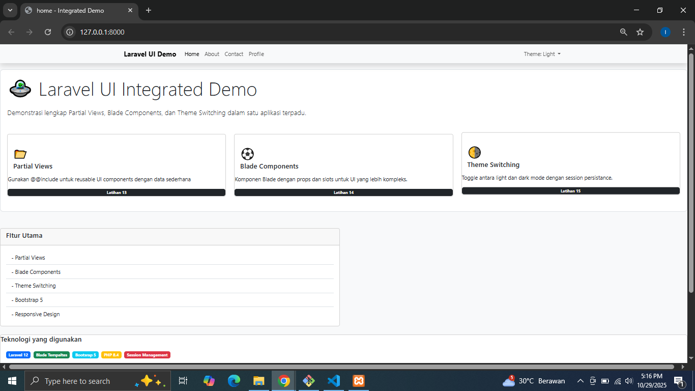
        - About 
        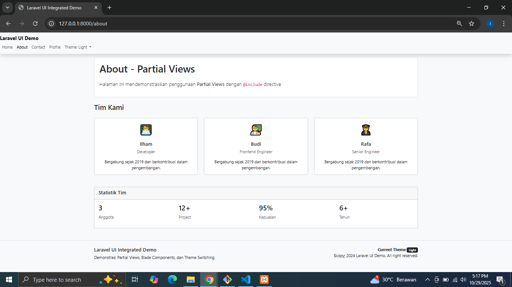
        - Contact 
        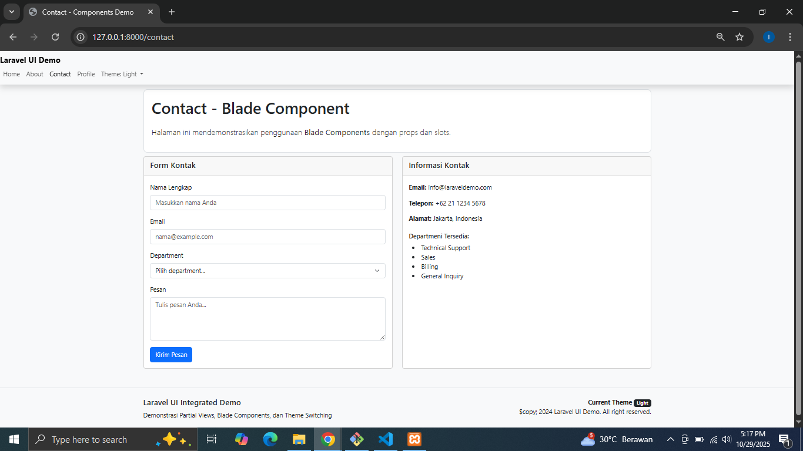
        - Profile 
        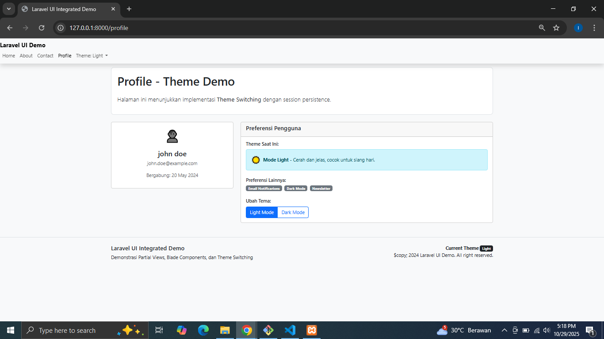


---

## 3. Hasil dan Pembahasan
- Apakah aplikasi berjalan sesuai harapan?
    - Alhamdulillah hasil dari praktikum ini sesuai harapan meskipun menjumpai beberapa error yang disebabkan karena terlalu terburu-buru sehingga beberapa kali typo.
- Cara Menggunakan Blade Templating Pada Laravel
    - untuk menggunakan fitur Blade Templating ini kita tidak perlu menginstall sesuatu untuk menggunakannya karena fitur Blade Templating sudah otomatis aktif apabila kita telah menginstall framework Laravel. Itulah sebabnya mengapa pada framework Laravel terdapat tulisa “blade” pada format file PHP. Jika kita menghapus tulisan “blade” pada file PHP pada folder views maka fitur Blade Templating akan tidak bisa digunakan dan file berubah menjadi file PHP biasa.
- Apa peran masing-masing komponen (Route, Controller, View) dalam program yang dibuat?
    - Route = Berperan sebagai tempat untuk pengalamatan yang akan ditampilkan ke user
    - Controller = Beperan sebagai pengatur logika atau validasi yang digunakan saat request dan respon ke user.
    - View = Berperan bekerja sama dengan controller, yaitu saat controller meminta request dari user lalu melakukan validasi atau eksekusi program maka setelah itu akan ditampilkan hasil eksekusi yang dilakukan. dan tugas yang mengatur tampilan atau menyajikan tampilan data tersebut adalah view.
    - Blade = Berperan sebagai template engine yang menjembatani logika PHP dengan tampilan HTML. Dengan Blade, kita dapat menggunakan direktif seperti @if, @foreach, @extends, dan @include untuk membuat tampilan yang dinamis dan mudah dipelihara

---

## 4. Kesimpulan
- Kesimpulan dari praktikum ini adalah framwork Laravel yang memiliki tampilan dinamis dan terstruktur dengan menggunakan sistem layout, components, dan includes. Selain itu, penggunaan Blade juga membuat pengguna tidak susah payah untuk mengoding dari html ke php, hanya dengan blade kode HTML ditranslate agar bisa di baca dengan laravel, selain itu menggunakan blade membuat lebih rapi, tidak berulang (DRY), dan mudah dikembangkan untuk proyek yang lebih besar.

---

## 5. Referensi
- https://www.rumahweb.com/journal/belajar-laravel-bagian-4/
- https://buildwithangga.com/tips/cara-menggunakan-blade-templating-pada-laravel
- https://hackmd.io/@mohdrzu/r1AIUzWpll