# Laporan Modul 5: Form Submission & Data Validation
**Mata Kuliah:** Workshop Web Lanjut   
**Nama:** Ilham Syahdienar  
**NIM:** 2024573010029
**Kelas:** TI-2C

---

## Abstrak
Laporan ini membahas tentang bagaimana cara membuat form submision yang menggunakan HTTP methods, apa itu csrf lalu bagaimana data validation di laravel digunakan untuk memastikan data yang di input sesuai dengan ketentuan yang ber;aku, seperti di tabel pada databasenya.

---

## 1. Dasar Teori
- Apa saja HTTP methods dalam form??
    - POST : Mengirim data baru (create)
    - PUT/PATCH : Mengupdate data existing
    - DELETE : Menghapus data
    - GET : Mengambil data (tidak untuk form submission)
- Cara kerja form submission bagaimana?
    - User mengisi form dan menekan submit
    - Browser mengirim HTTP request ke route yang ditentukan
    - Middleware memproses request (termasuk CSRF verification)
    - Route mengarahkan ke controller method
    - Controller memvalidasi data
    - Jika valid: data diproses, jika tidak: error dikembalikan
    - Response dikirim kembali ke user
- Apa itu CSRF?
    - CSRF (Cross-Site Request Forgery) adalah jenis serangan di mana seorang hacker mencoba membuat pengguna yang terautentikasi melakukan aksi yang tidak diinginkan di website tanpa sepengetahuan mereka.
- Validation Rules
    - Format untuk penulisan rules adalah:
    - String Format: `'field' => 'required|email|max:255'`
    - Array Format: `'field' => ['required', 'email', 'max:255']`
- Kategori Validation Rules
    - Basic Rules:
        - required: Field wajib diisi
        - nullable: Field boleh kosong
        - filled: Jika ada, harus berisi nilai
        - sometimes: Validasi hanya jika field ada
    - Type Validation
        - string: Harus string
        - numeric: Harus angka
        - integer: Harus integer
        - boolean: Harus boolean
        - array: Harus array
        - file: Harus file upload
    - Size Validation
        - min:value: Minimum size (string length, numeric value, file size)
        - max:value: Maximum size
        - size:value: Exact size
        - between:min,max: Rentang nilai
    - Database Rules
        - unique:table,column: Nilai harus unik di database
        - exists:table,column: Nilai harus ada di database
    - Comparison Rules
        - confirmed: Field harus memiliki field _confirmation
        - same:field: Harus sama dengan field lain
        - different:field: Harus berbeda dari field lain
    - Conditional Validation
        - Validasi yang bergantung pada kondisi tertentu:
        ```
        'discount' => 'required_if:is_sale,true', // wajib jika is_sale = true
        'reason' => 'required_unless:status,approved', // wajib kecuali status approved
        'backup_email' => 'required_with:phone', // wajib jika phone ada
        'notes' => 'required_without:description' // wajib jika description kosong
        ``

---

## 2. Langkah-Langkah Praktikum
- ##### 2.1 Praktikum 1 - Menangani Request dan Response View di Laravel 12
    - 1. Buat project baru dengan nama `form-app` di folder projects tempat menyimpan folder folder project pada pertemuan sebelumnya menggunakan vscode, buka git bash, dan masuk ke direktori projects:
        - `composer create-project laravel/laravel form-app`
        - masuk ke direktori form-app
    - 2. Buat Controller dengan nama controller:
        - `php artisan make:controller FormController`
    - 3. Setelah membuat controller, selanjutnya definisikan route nya di routes/web.php, tambahkan seperti ini:
        ```
        use App\Http\Controllers\FormController;
        Route::get('/form', [FormController::class, 'showForm'])->name('form.show');
        Route::post('/form', [FormController::class, 'handleForm'])->name('form.handle');
        Route::get('/result', [FormController::class, 'showResult'])->name('form.result');
    - 4. Selanjutnya kita akan buat metode untuk menangani logika form pada controller dengan cara masuk ke app/Http/Controllers/FormController.php lalu tambahkan code berikut:
    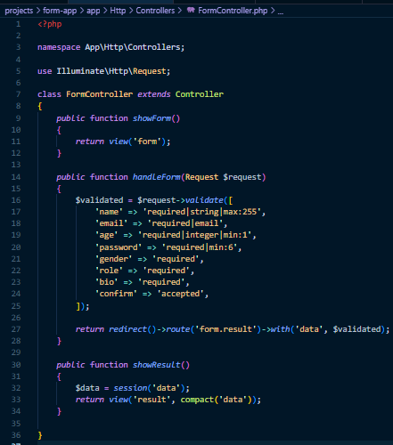
    - 5. Di `resources/views` buat file baru dengan nama `form.blade.php`, lalu isi file tersebut dengan kode program seperti gambar di bawah ini:
    ```
    <!DOCTYPE html>
        <html>
        <head>
            <title>Pengiriman Form</title>
            <link href="https://cdn.jsdelivr.net/npm/bootstrap@5.3.3/dist/css/bootstrap.min.css" rel="stylesheet">
        </head>
        <body class="container mt-5">
            <h2>Form Registrasi</h2>
            <form method="POST" action="{{ route('form.handle') }}">
                @csrf
                <div class="mb-3">
                    <label>Nama</label>
                    <input type="text" name="name" class="form-control" value="{{ old('name') }}">
                    @error('name') <div class="text-danger">{{ $message }}</div> @enderror
                </div>
                <div class="mb-3">
                    <label>Email</label>
                    <input type="email" name="email" class="form-control" value="{{ old('email') }}">
                    @error('email') <div class="text-danger">{{ $message }}</div> @enderror
                </div>
                <div class="mb-3">
                    <label>Umur</label>
                    <input type="number" name="age" class="form-control" value="{{ old('age') }}">
                    @error('age') <div class="text-danger">{{ $message }}</div> @enderror
                </div>
                <div class="mb-3">
                    <label>Password</label>
                    <input type="password" name="password" class="form-control">
                    @error('password') <div class="text-danger">{{ $message }}</div> @enderror
                </div>
                <div class="mb-3">
                    <label>Jenis Kelamin</label><br>
                    <div class="form-check form-check-inline">
                        <input class="form-check-input" type="radio" name="gender" value="male"> Laki-laki
                    </div>
                    <div class="form-check form-check-inline">
                        <input class="form-check-input" type="radio" name="gender" value="female"> Perempuan
                    </div>
                    @error('gender') <div class="text-danger">{{ $message }}</div> @enderror
                </div>
                <div class="mb-3">
                    <label>Role</label>
                    <select name="role" class="form-select">
                        <option value="">-- Pilih Role --</option>
                        <option value="user">User</option>
                        <option value="admin">Admin</option>
                    </select>
                    @error('role') <div class="text-danger">{{ $message }}</div> @enderror
                </div>
                <div class="mb-3">
                    <label>Bio</label>
                    <textarea name="bio" class="form-control">{{ old('bio') }}</textarea>
                    @error('bio') <div class="text-danger">{{ $message }}</div> @enderror
                </div>
                <div class="form-check mb-3">
                    <input type="checkbox" id="confirm" name="confirm" class="form-check-input">
                    <label class="form-check-label" for="confirm">Saya konfirmasi informasi sudah benar</label>
                    @error('confirm') <div class="text-danger">{{ $message }}</div> @enderror
                </div>
                <button type="submit" class="btn btn-primary" id="submitBtn" disabled>Submit</button>
            </form>

            <script>
                document.getElementById('confirm').addEventListener('change', function() {
                    document.getElementById('submitBtn').disabled = !this.checked;
                });
            </script>
        </body>
        </html>
    ```
    - 6. Masih di `resources/views` buat file baru dengan nama `result.blade.php`, file ini akan menampilkan hasil form yang telahdiinput oleh user. Lalu isi file tersebut dengan kode program seperti gambar di bawah ini:
    ```
    <!DOCTYPE html>
    <html>
        <head>
            <title>Hasil Form</title>
            <link rel="stylesheet" href="https://cdn.jsdelivr.net/npm/bootstrap@5.3.3/dist/css/bootstrap.min.css">
        </head>
        <body class="container mt-5">
            <h2>Data Form yang dikirim</h2>
            @if ($data)
                <ul class="list-group">
                    @foreach ($data as $key => $value)
                        <li class="list-group-item"><Strong>{{ ucfirst($key) }}:</Strong> {{ $value }}</li>
                    @endforeach
                </ul>
            @else
                <p>Tidak ada data tersedia</p>
            @endif
        </body>
    </html>
    ```

    - 7. Jalankan project laravel yang kita buat dengan mengetik `php artisan serve` diterminal atau git bash
    - 8. Buka browser lalu ketik `http:localhost:8000/form`, maka nanti akan keluar hasil yang sudah kita coba seperti gambar dibawah ini:
    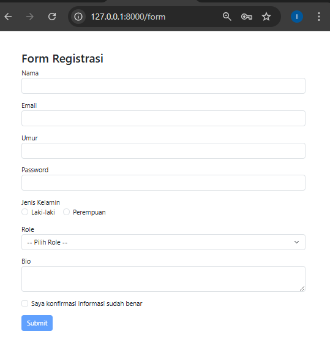
    lalu jika sudah mengisi formnya dan kita akan menekan tombol submit maka akan menampilkan data yang dikirim:
    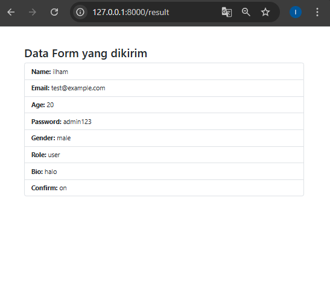
    jika kita mencoba mengirim form tanpa mengisi field yang wajib maka akan melihat error validasi, dan juga jika mencoba mengirim tanpa mencentang checkbox maka tombol submit tidak akan bisa ditekan sampai kita mencentang checkbox.

---

- ##### 2.2 Praktikum 2 – Validasi Kustom dan Pesan Error di Laravel 12
    - 1. Buka project yang sudah dibuat pada praktikum sebelumnya, yaitu `form-app`
    - 2. Selanjutnya kita buat controller baru, dengan nama RegisterController, untuk membuat controller tersebut kita dapat gunakan perintah: 
        - `php artisan make:controller RegisterController`
    - 3. Lalu pada file controller yang sudah dibuat yaitu RegisterController, tambahkan logika dengan kode program seperti dibawah ini:
    ```
        <?php

        namespace App\Http\Controllers;

        use Illuminate\Http\Request;

        class RegisterController extends Controller
        {
            public function showForm()
            {
                return view('register');
            }

            public function handleform(Request $request)
            {
                $customMessages = [
                    'name.required' => 'kami perlu tahu nama anda',
                    'email.required' => 'Email anda penting bagi kami',
                    'email.email' => 'hmm...Itu tidak terlihat seperti email yang valid',
                    'password.required' => 'jangan lupa untuk set password',
                    'password.min' => 'password harus minimal :min karakter',
                    'username.regex' => 'username hanya boleh berisi huruf dan angka',
                ];

                $request->validate([
                    'name' => 'required|string|max:100',
                    'email' => 'required|email',
                    'username' => ['required', 'regex:/^[a-z A-Z 0-9]+$/'],
                    'password' => 'required|min:6',
                ], $customMessages);

                return redirect()->route('register.show')->with('success', 'registrasi berhasil');
            }
        }
        
    ```

    - 4. Selanjutnya kita tambahkan route RegisterController di routes/web.php, ikuti seperti gambar dibawah ini:
    ```
    use App\Http\Controllers\RegisterController;

    Route::get('/register', [RegisterController::class, 'showForm'])->name('register.show');
    Route::post('/register', [RegisterController::class, 'handleForm'])->name('register.handle');

    ```
    - 5. Setelah menambabhkan rute RegisterController di routes/web.php, kita buat file di folder `resources/views` buat file `Register.blade.php`, dan isi file tersebut dengan kode program pada dibawah ini:
        ```blade
        <!DOCTYPE html>
        <html>
        <head>
            <title>Form Register</title>
            <link rel="stylesheet" href="https://cdn.jsdelivr.net/npm/bootstrap@5.3.3/dist/css/bootstrap.min.css">
        </head>
        <body class="container mt-5">
            <h2>Contoh Validasi Custom</h2>

            @if (session('success'))
                <div class="alert alert-success">
                    {{ session('success') }}
                </div>
            @endif

            <form  method="POST" action="{{ route('register.handle')}}">
                @csrf
                <div class="mb-3">
                    <label for="name">Nama lengkap</label>
                    <input name="name" class="form-control" value="{{ old('name') }}">
                    @error('name')
                        <div class="text-danger">{{ $message }}</div>
                    @enderror
                </div>
                <div class="mb-3">
                    <label for="email">Alamat Email</label>
                    <input name="email" class="form-control" value="{{ old('email')}}">
                    @error('email') 
                        <div class="text-danger">{{ $message }}</div>
                    @enderror
                </div>
                <div class="mb-3">
                    <label for="username">Username</label>
                    <input name="username" class="form-control" value="{{ old('username')}}">
                    @error('username') 
                        <div class="text-danger">{{ $message }}</div>
                    @enderror
                </div>
                <div class="mb-3">
                    <label for="password">Password</label>
                    <input name="password" type="password" class="form-control">
                    @error('password') 
                        <div class="text-danger">{{ $message }}</div>
                    @enderror
                </div>
                <button type="submit" class="btn btn-primary">Register</button>
            </form>
        </body>
        </html>
        ```

    - 6. Setelah melakukan langkah-langkah diatas, maka pada langkah terakhir yaitu menjalankan server laravel dengan perintah `php artisan serve`, masuk ke:`http://127.0.0.1:8000/register`
    setelah itu buka browser dan akan keluar tampilan seperti gambar dibawah ini:
        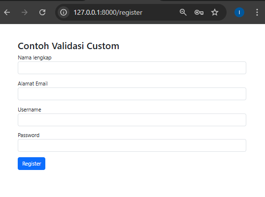
        - Lakukan percobaan seperti dibawah untuk mengetest aturan dan definisi yang digunakan di kode program:
            - Biarkan field kosong
            - Masukkan email tidak valid
            - Ketik non-alphanumeric di username
            - Gunakan password pendek
        - Maka akan menampilkan text error seperti ini:
        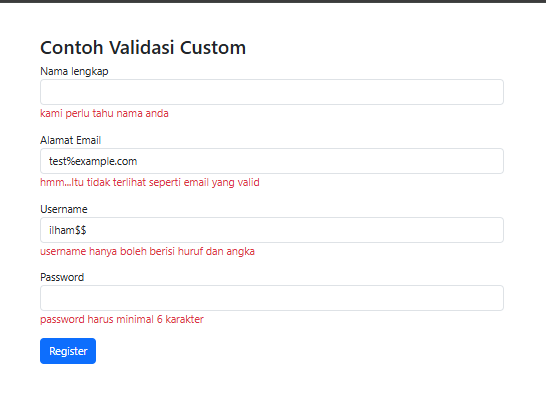
        - Tetapi jika sesuai dengan aturan dan definisi maka setelah menekan tombol register akan keluar notifikasi yang menyatakan regisrasi berhasil

---    

- ##### 2.3 Praktikum 3 - Multi-Step Form Submission dengan Session Data
    - 1. Buat project baru dengan nama multistep-form-app di folder projects tempat menyimpan folder folder project pada pertemuan sebelumnya menggunakan vscode, buka git bash, dan masuk ke direktori projects, lalu perintah untuk membuat project baru:
        - `composer create-project laravel/laravel multistep-form-app`
        - masuk ke direktori modul-4-laravel-ui
    - 2. Buat Controller dengan nama controller:
        - `php artisan make:controller MultiStepFormController`
    - 3. Setelah membuat controller, selanjutnya definisikan route nya di routes/web.php, tambahkan seperti ini:
        ```
        <?php

        use App\Http\Controllers\MultiStepFormController;
        use Illuminate\Support\Facades\Route;

        Route::get('/multistep', [MultiStepFormController::class, 'showStep1'])->name('multistep.step1');
        Route::post('/multistep/step1', [MultiStepFormController::class, 'storeStep1'])->name('multistep.storeStep1');
        Route::get('/multistep/step2', [MultiStepFormController::class, 'showStep2'])->name('multistep.step2');
        Route::post('/multistep/step2', [MultiStepFormController::class, 'storeStep2'])->name('multistep.storeStep2');
        Route::get('/multistep/step3', [MultiStepFormController::class, 'showStep3'])->name('multistep.step3');
        Route::post('/multistep/step3', [MultiStepFormController::class, 'storeStep3'])->name('multistep.storeStep3');
        Route::get('/multistep/summary', [MultiStepFormController::class, 'showSummary'])->name('multistep.summary');
        Route::post('/multistep/complete', [MultiStepFormController::class, 'complete'])->name('multistep.complete');

    - 4. Selanjutnya kita akan mengupdate data pada controller dengan cara masuk ke app/Http/Controllers/MultiStepFormController.php lalu tambahkan code berikut:
        ```blade
           <?php

            namespace App\Http\Controllers;

            use Illuminate\Http\Request;

            class MultiStepFormController extends Controller
            {
                // Step 1 - Informasi Pribadi
                public function showStep1()
                {
                    return view('multistep.step1', [
                        'step' => 1,
                        'progress' => 0
                    ]);
                }

                public function storeStep1(Request $request)
                {
                    $validated = $request->validate([
                        'full_name' => 'required|string|max:100',
                        'email' => 'required|email',
                        'phone' => 'required|string|max:15',
                        'address' => 'required|string|max:200',
                    ]);

                    // Simpan data ke session
                    session(['step1_data' => $validated]);

                    return redirect()->route('multistep.step2');
                }

                // Step 2 - Informasi Pendidikan
                public function showStep2()
                {
                    if (!session('step1_data')) {
                        return redirect()->route('multistep.step1');
                    }

                    return view('multistep.step2', [
                        'step' => 2,
                        'progress' => 33
                    ]);
                }

                public function storeStep2(Request $request)
                {
                    $validated = $request->validate([
                        'education' => 'required|string|max:50',
                        'institution' => 'required|string|max:100',
                        'graduation_year' => 'required|integer|min:1900|max:' . date('Y'),
                        'major' => 'required|string|max:100',
                    ]);

                    session(['step2_data' => $validated]);

                    return redirect()->route('multistep.step3');
                }

                // Step 3 - Pengalaman Kerja
                public function showStep3()
                {
                    if (!session('step1_data') || !session('step2_data')) {
                        return redirect()->route('multistep.step1');
                    }

                    return view('multistep.step3', [
                        'step' => 3,
                        'progress' => 66
                    ]);
                }

                public function storeStep3(Request $request)
                {
                    $validated = $request->validate([
                        'current_job' => 'nullable|string|max:100',
                        'company' => 'nullable|string|max:100',
                        'experience_years' => 'required|integer|min:0|max:50',
                        'skills' => 'required|string|max:200',
                    ]);

                    session(['step3_data' => $validated]);

                    return redirect()->route('multistep.summary');
                }

                // Summary - Ringkasan Data
                public function showSummary()
                {
                    $step1Data = session('step1_data');
                    $step2Data = session('step2_data');
                    $step3Data = session('step3_data');

                    if (!$step1Data || !$step2Data || !$step3Data) {
                        return redirect()->route('multistep.step1');
                    }

                    return view('multistep.summary', [
                        'step' => 4,
                        'progress' => 100,
                        'step1Data' => $step1Data,
                        'step2Data' => $step2Data,
                        'step3Data' => $step3Data
                    ]);
                }

                // Complete - Proses Final
                public function complete(Request $request)
                {
                    // Di sini Anda bisa menyimpan data ke database
                    // Untuk demo, kita hanya akan menampilkan pesan sukses

                    $allData = [
                        'personal' => session('step1_data'),
                        'education' => session('step2_data'),
                        'experience' => session('step3_data')
                    ];

                    // Hapus session data
                    $request->session()->forget(['step1_data', 'step2_data', 'step3_data']);

                    return view('multistep.complete', [
                        'data' => $allData
                    ]);
                }
            }

    - 5. Selanjutnya kita akan membuat layout dasar, di `resources/views/` buat direktori baru yaitu `layouts`, lalu di direktori tersebut buat file app.blade.php, dan isikan kode berikut:
    ```
        <!DOCTYPE html>
        <html lang="id">
        <head>
            <meta charset="UTF-8">
            <meta name="viewport" content="width=device-width, initial-scale=1.0">
            <title>@yield('title', 'Multi-Step Form')</title>
            <link href="https://cdn.jsdelivr.net/npm/bootstrap@5.3.3/dist/css/bootstrap.min.css" rel="stylesheet">
            <style>
                .step-progress {
                    margin-bottom: 30px;
                }
                .step-item {
                    text-align: center;
                    position: relative;
                }
                .step-item .step-number {
                    width: 40px;
                    height: 40px;
                    border-radius: 50%;
                    background: #e9ecef;
                    display: flex;
                    align-items: center;
                    justify-content: center;
                    margin: 0 auto 10px;
                    font-weight: bold;
                }
                .step-item.active .step-number {
                    background: #007bff;
                    color: white;
                }
                .step-item.completed .step-number {
                    background: #28a745;
                    color: white;
                }
                .step-line {
                    position: absolute;
                    top: 20px;
                    left: 50%;
                    width: 100%;
                    height: 2px;
                    background: #e9ecef;
                    z-index: -1;
                }
                .form-step {
                    display: none;
                }
                .form-step.active {
                    display: block;
                }
                .card {
                    box-shadow: 0 0.5rem 1rem rgba(0, 0, 0, 0.15);
                }
            </style>
        </head>
        <body>
            <nav class="navbar navbar-dark bg-dark">
                <div class="container">
                    <span class="navbar-brand mb-0 h1">Multi-Step Form Demo</span>
                </div>
            </nav>

            <div class="container mt-4">
                @yield('content')
            </div>

            <script src="https://cdn.jsdelivr.net/npm/bootstrap@5.3.3/dist/js/bootstrap.bundle.min.js"></script>
        </body>
        </html>
    ```

    - 6. Buat Views untuk setiap step by step, dengan cara buat direktori baru `multistep` di `resources/views/` lalu buat file-file blade di bawah ini:
        - step1.blade.php
        - step2.blade.php
        - step3.blade.php
        - summary.blade.php
        - complete.blade.php

    - 7. setelah membuat view blade yang dibutuhkan, selanjutnya kita akan mengedit atau mengisi file file tersebut dengan kode kode program yang disesuaikan dengan kebutuhan
        - step1.blade.php
        ```
        @extends('layouts.app')

        @section('title', 'Step 1 - Informasi Pribadi')

        @section('content')
        <div class="row justify-content-center">
            <div class="col-md-8">
                <!-- Progress Bar -->
                <div class="step-progress">
                    <div class="row">
                        <div class="col-3 step-item active">
                            <div class="step-number">1</div>
                            <div>Informasi Pribadi</div>
                        </div>
                        <div class="col-3 step-item">
                            <div class="step-number">2</div>
                            <div>Pendidikan</div>
                        </div>
                        <div class="col-3 step-item">
                            <div class="step-number">3</div>
                            <div>Pengalaman</div>
                        </div>
                        <div class="col-3 step-item">
                            <div class="step-number">4</div>
                            <div>Ringkasan</div>
                        </div>
                    </div>
                </div>

                <div class="card">
                    <div class="card-header">
                        <h4 class="mb-0">Step 1: Informasi Pribadi</h4>
                    </div>
                    <div class="card-body">
                        <form method="POST" action="{{ route('multistep.storeStep1') }}">
                            @csrf
                            
                            <div class="row">
                                <div class="col-md-6 mb-3">
                                    <label for="full_name" class="form-label">Nama Lengkap *</label>
                                    <input type="text" class="form-control @error('full_name') is-invalid @enderror" 
                                        id="full_name" name="full_name" 
                                        value="{{ old('full_name', session('step1_data.full_name') ?? '') }}" 
                                        required>
                                    @error('full_name')
                                        <div class="invalid-feedback">{{ $message }}</div>
                                    @enderror
                                </div>
                                
                                <div class="col-md-6 mb-3">
                                    <label for="email" class="form-label">Email *</label>
                                    <input type="email" class="form-control @error('email') is-invalid @enderror" 
                                        id="email" name="email" 
                                        value="{{ old('email', session('step1_data.email') ?? '') }}" 
                                        required>
                                    @error('email')
                                        <div class="invalid-feedback">{{ $message }}</div>
                                    @enderror
                                </div>
                            </div>

                            <div class="row">
                                <div class="col-md-6 mb-3">
                                    <label for="phone" class="form-label">Nomor Telepon *</label>
                                    <input type="text" class="form-control @error('phone') is-invalid @enderror" 
                                        id="phone" name="phone" 
                                        value="{{ old('phone', session('step1_data.phone') ?? '') }}" 
                                        required>
                                    @error('phone')
                                        <div class="invalid-feedback">{{ $message }}</div>
                                    @enderror
                                </div>
                                
                                <div class="col-md-6 mb-3">
                                    <label for="address" class="form-label">Alamat *</label>
                                    <input type="text" class="form-control @error('address') is-invalid @enderror" 
                                        id="address" name="address" 
                                        value="{{ old('address', session('step1_data.address') ?? '') }}" 
                                        required>
                                    @error('address')
                                        <div class="invalid-feedback">{{ $message }}</div>
                                    @enderror
                                </div>
                            </div>

                            <div class="d-flex justify-content-between">
                                <div></div> <!-- Spacer -->
                                <button type="submit" class="btn btn-primary">
                                    Lanjut ke Step 2 <i class="fas fa-arrow-right ms-2"></i>
                                </button>
                            </div>
                        </form>
                    </div>
                </div>
            </div>
        </div>
        @endsection
        ```

        - step2.blade.php
        ```
        @extends('layouts.app')

        @section('title', 'Step 2 - Informasi Pendidikan')

        @section('content')
        <div class="row justify-content-center">
            <div class="col-md-8">
                <!-- Progress Bar -->
                <div class="step-progress">
                    <div class="row">
                        <div class="col-3 step-item completed">
                            <div class="step-number">✓</div>
                            <div>Informasi Pribadi</div>
                        </div>
                        <div class="col-3 step-item active">
                            <div class="step-number">2</div>
                            <div>Pendidikan</div>
                        </div>
                        <div class="col-3 step-item">
                            <div class="step-number">3</div>
                            <div>Pengalaman</div>
                        </div>
                        <div class="col-3 step-item">
                            <div class="step-number">4</div>
                            <div>Ringkasan</div>
                        </div>
                    </div>
                </div>

                <div class="card">
                    <div class="card-header">
                        <h4 class="mb-0">Step 2: Informasi Pendidikan</h4>
                    </div>
                    <div class="card-body">
                        <form method="POST" action="{{ route('multistep.storeStep2') }}">
                            @csrf
                            
                            <div class="mb-3">
                                <label for="education" class="form-label">Tingkat Pendidikan *</label>
                                <select class="form-select @error('education') is-invalid @enderror" 
                                        id="education" name="education" required>
                                    <option value="">Pilih Tingkat Pendidikan</option>
                                    <option value="SMA" {{ old('education', session('step2_data.education') ?? '') == 'SMA' ? 'selected' : '' }}>SMA</option>
                                    <option value="D3" {{ old('education', session('step2_data.education') ?? '') == 'D3' ? 'selected' : '' }}>D3</option>
                                    <option value="S1" {{ old('education', session('step2_data.education') ?? '') == 'S1' ? 'selected' : '' }}>S1</option>
                                    <option value="S2" {{ old('education', session('step2_data.education') ?? '') == 'S2' ? 'selected' : '' }}>S2</option>
                                    <option value="S3" {{ old('education', session('step2_data.education') ?? '') == 'S3' ? 'selected' : '' }}>S3</option>
                                </select>
                                @error('education')
                                    <div class="invalid-feedback">{{ $message }}</div>
                                @enderror
                            </div>

                            <div class="row">
                                <div class="col-md-8 mb-3">
                                    <label for="institution" class="form-label">Nama Institusi *</label>
                                    <input type="text" class="form-control @error('institution') is-invalid @enderror" 
                                        id="institution" name="institution" 
                                        value="{{ old('institution', session('step2_data.institution') ?? '') }}" 
                                        required>
                                    @error('institution')
                                        <div class="invalid-feedback">{{ $message }}</div>
                                    @enderror
                                </div>
                                
                                <div class="col-md-4 mb-3">
                                    <label for="graduation_year" class="form-label">Tahun Lulus *</label>
                                    <input type="number" class="form-control @error('graduation_year') is-invalid @enderror" 
                                        id="graduation_year" name="graduation_year" 
                                        value="{{ old('graduation_year', session('step2_data.graduation_year') ?? '') }}" 
                                        min="1900" max="{{ date('Y') }}" required>
                                    @error('graduation_year')
                                        <div class="invalid-feedback">{{ $message }}</div>
                                    @enderror
                                </div>
                            </div>

                            <div class="mb-3">
                                <label for="major" class="form-label">Jurusan *</label>
                                <input type="text" class="form-control @error('major') is-invalid @enderror" 
                                    id="major" name="major" 
                                    value="{{ old('major', session('step2_data.major') ?? '') }}" 
                                    required>
                                @error('major')
                                    <div class="invalid-feedback">{{ $message }}</div>
                                @enderror
                            </div>

                            <div class="d-flex justify-content-between">
                                <a href="{{ route('multistep.step1') }}" class="btn btn-secondary">
                                    <i class="fas fa-arrow-left me-2"></i>Kembali
                                </a>
                                <button type="submit" class="btn btn-primary">
                                    Lanjut ke Step 3 <i class="fas fa-arrow-right ms-2"></i>
                                </button>
                            </div>
                        </form>
                    </div>
                </div>
            </div>
        </div>
        @endsection
        ```

        - step3.blade.php
        ```
        @extends('layouts.app')

        @section('title', 'Step 3 - Pengalaman Kerja')

        @section('content')
        <div class="row justify-content-center">
            <div class="col-md-8">
                <!-- Progress Bar -->
                <div class="step-progress">
                    <div class="row">
                        <div class="col-3 step-item completed">
                            <div class="step-number">✓</div>
                            <div>Informasi Pribadi</div>
                        </div>
                        <div class="col-3 step-item completed">
                            <div class="step-number">✓</div>
                            <div>Pendidikan</div>
                        </div>
                        <div class="col-3 step-item active">
                            <div class="step-number">3</div>
                            <div>Pengalaman</div>
                        </div>
                        <div class="col-3 step-item">
                            <div class="step-number">4</div>
                            <div>Ringkasan</div>
                        </div>
                    </div>
                </div>

                <div class="card">
                    <div class="card-header">
                        <h4 class="mb-0">Step 3: Pengalaman Kerja</h4>
                    </div>
                    <div class="card-body">
                        <form method="POST" action="{{ route('multistep.storeStep3') }}">
                            @csrf
                            
                            <div class="row">
                                <div class="col-md-6 mb-3">
                                    <label for="current_job" class="form-label">Pekerjaan Saat Ini</label>
                                    <input type="text" class="form-control @error('current_job') is-invalid @enderror" 
                                        id="current_job" name="current_job" 
                                        value="{{ old('current_job', session('step3_data.current_job') ?? '') }}">
                                    @error('current_job')
                                        <div class="invalid-feedback">{{ $message }}</div>
                                    @enderror
                                </div>
                                
                                <div class="col-md-6 mb-3">
                                    <label for="company" class="form-label">Perusahaan</label>
                                    <input type="text" class="form-control @error('company') is-invalid @enderror" 
                                        id="company" name="company" 
                                        value="{{ old('company', session('step3_data.company') ?? '') }}">
                                    @error('company')
                                        <div class="invalid-feedback">{{ $message }}</div>
                                    @enderror
                                </div>
                            </div>

                            <div class="row">
                                <div class="col-md-6 mb-3">
                                    <label for="experience_years" class="form-label">Pengalaman Kerja (Tahun) *</label>
                                    <input type="number" class="form-control @error('experience_years') is-invalid @enderror" 
                                        id="experience_years" name="experience_years" 
                                        value="{{ old('experience_years', session('step3_data.experience_years') ?? '') }}" 
                                        min="0" max="50" required>
                                    @error('experience_years')
                                        <div class="invalid-feedback">{{ $message }}</div>
                                    @enderror
                                </div>
                            </div>

                            <div class="mb-3">
                                <label for="skills" class="form-label">Keahlian/Keterampilan *</label>
                                <textarea class="form-control @error('skills') is-invalid @enderror" 
                                        id="skills" name="skills" rows="3" 
                                        placeholder="Contoh: PHP, Laravel, JavaScript, MySQL..." 
                                        required>{{ old('skills', session('step3_data.skills') ?? '') }}</textarea>
                                @error('skills')
                                    <div class="invalid-feedback">{{ $message }}</div>
                                @enderror
                                <div class="form-text">Pisahkan setiap keahlian dengan koma</div>
                            </div>

                            <div class="d-flex justify-content-between">
                                <a href="{{ route('multistep.step2') }}" class="btn btn-secondary">
                                    <i class="fas fa-arrow-left me-2"></i>Kembali
                                </a>
                                <button type="submit" class="btn btn-primary">
                                    Lihat Ringkasan <i class="fas fa-arrow-right ms-2"></i>
                                </button>
                            </div>
                        </form>
                    </div>
                </div>
            </div>
        </div>
        @endsection
        ```

        - summary.blade.php
        ```
        @extends('layouts.app')

        @section('title', 'Ringkasan Data')

        @section('content')
        <div class="row justify-content-center">
            <div class="col-md-8">
                <!-- Progress Bar -->
                <div class="step-progress">
                    <div class="row">
                        <div class="col-3 step-item completed">
                            <div class="step-number">✓</div>
                            <div>Informasi Pribadi</div>
                        </div>
                        <div class="col-3 step-item completed">
                            <div class="step-number">✓</div>
                            <div>Pendidikan</div>
                        </div>
                        <div class="col-3 step-item completed">
                            <div class="step-number">✓</div>
                            <div>Pengalaman</div>
                        </div>
                        <div class="col-3 step-item active">
                            <div class="step-number">4</div>
                            <div>Ringkasan</div>
                        </div>
                    </div>
                </div>

                <div class="card">
                    <div class="card-header bg-success text-white">
                        <h4 class="mb-0">Ringkasan Data Anda</h4>
                    </div>
                    <div class="card-body">
                        <!-- Informasi Pribadi -->
                        <div class="mb-4">
                            <h5 class="border-bottom pb-2">
                                <i class="fas fa-user me-2"></i>Informasi Pribadi
                                <a href="{{ route('multistep.step1') }}" class="btn btn-sm btn-outline-primary float-end">Edit</a>
                            </h5>
                            <div class="row">
                                <div class="col-md-6">
                                    <strong>Nama Lengkap:</strong><br>
                                    {{ $step1Data['full_name'] }}
                                </div>
                                <div class="col-md-6">
                                    <strong>Email:</strong><br>
                                    {{ $step1Data['email'] }}
                                </div>
                            </div>
                            <div class="row mt-2">
                                <div class="col-md-6">
                                    <strong>Telepon:</strong><br>
                                    {{ $step1Data['phone'] }}
                                </div>
                                <div class="col-md-6">
                                    <strong>Alamat:</strong><br>
                                    {{ $step1Data['address'] }}
                                </div>
                            </div>
                        </div>

                        <!-- Informasi Pendidikan -->
                        <div class="mb-4">
                            <h5 class="border-bottom pb-2">
                                <i class="fas fa-graduation-cap me-2"></i>Informasi Pendidikan
                                <a href="{{ route('multistep.step2') }}" class="btn btn-sm btn-outline-primary float-end">Edit</a>
                            </h5>
                            <div class="row">
                                <div class="col-md-4">
                                    <strong>Tingkat Pendidikan:</strong><br>
                                    {{ $step2Data['education'] }}
                                </div>
                                <div class="col-md-4">
                                    <strong>Institusi:</strong><br>
                                    {{ $step2Data['institution'] }}
                                </div>
                                <div class="col-md-4">
                                    <strong>Tahun Lulus:</strong><br>
                                    {{ $step2Data['graduation_year'] }}
                                </div>
                            </div>
                            <div class="row mt-2">
                                <div class="col-12">
                                    <strong>Jurusan:</strong><br>
                                    {{ $step2Data['major'] }}
                                </div>
                            </div>
                        </div>

                        <!-- Pengalaman Kerja -->
                        <div class="mb-4">
                            <h5 class="border-bottom pb-2">
                                <i class="fas fa-briefcase me-2"></i>Pengalaman Kerja
                                <a href="{{ route('multistep.step3') }}" class="btn btn-sm btn-outline-primary float-end">Edit</a>
                            </h5>
                            <div class="row">
                                <div class="col-md-6">
                                    <strong>Pekerjaan Saat Ini:</strong><br>
                                    {{ $step3Data['current_job'] ?? 'Tidak disebutkan' }}
                                </div>
                                <div class="col-md-6">
                                    <strong>Perusahaan:</strong><br>
                                    {{ $step3Data['company'] ?? 'Tidak disebutkan' }}
                                </div>
                            </div>
                            <div class="row mt-2">
                                <div class="col-md-6">
                                    <strong>Pengalaman Kerja:</strong><br>
                                    {{ $step3Data['experience_years'] }} tahun
                                </div>
                                <div class="col-md-6">
                                    <strong>Keahlian:</strong><br>
                                    {{ $step3Data['skills'] }}
                                </div>
                            </div>
                        </div>

                        <div class="alert alert-info">
                            <i class="fas fa-info-circle me-2"></i>
                            <strong>Perhatian:</strong> Pastikan semua data sudah benar sebelum mengirim.
                        </div>

                        <form method="POST" action="{{ route('multistep.complete') }}">
                            @csrf
                            <div class="d-flex justify-content-between">
                                <a href="{{ route('multistep.step3') }}" class="btn btn-secondary">
                                    <i class="fas fa-arrow-left me-2"></i>Kembali
                                </a>
                                <button type="submit" class="btn btn-success">
                                    <i class="fas fa-check me-2"></i>Kirim Data
                                </button>
                            </div>
                        </form>
                    </div>
                </div>
            </div>
        </div>
        @endsection
        ```

        - complete.blade.php
        ```
        @extends('layouts.app')

        @section('title', 'Pendaftaran Selesai')

        @section('content')
        <div class="row justify-content-center">
            <div class="col-md-6">
                <div class="card text-center">
                    <div class="card-body py-5">
                        <div class="mb-4">
                            <i class="fas fa-check-circle text-success" style="font-size: 4rem;"></i>
                        </div>
                        <h2 class="card-title text-success mb-3">Pendaftaran Berhasil!</h2>
                        <p class="card-text lead mb-4">
                            Terima kasih telah melengkapi formulir pendaftaran. Data Anda telah berhasil disimpan.
                        </p>
                        
                        <div class="alert alert-info text-start">
                            <h6><i class="fas fa-envelope me-2"></i>Informasi Penting:</h6>
                            <ul class="mb-0">
                                <li>Anda akan menerima email konfirmasi dalam 24 jam</li>
                                <li>Proses verifikasi membutuhkan waktu 2-3 hari kerja</li>
                                <li>Tim kami akan menghubungi Anda untuk langkah selanjutnya</li>
                            </ul>
                        </div>

                        <div class="mt-4">
                            <a href="{{ route('multistep.step1') }}" class="btn btn-primary me-2">
                                <i class="fas fa-plus me-2"></i>Daftar Lagi
                            </a>
                            <a href="/" class="btn btn-outline-secondary">
                                <i class="fas fa-home me-2"></i>Kembali ke Home
                            </a>
                        </div>
                    </div>
                </div>

                <!-- Debug Data (bisa dihapus di production) -->
                @if(env('APP_DEBUG'))
                <div class="card mt-4">
                    <div class="card-header">
                        <h6 class="mb-0">Data yang Disimpan (Debug)</h6>
                    </div>
                    <div class="card-body">
                        <pre>{{ json_encode($data, JSON_PRETTY_PRINT) }}</pre>
                    </div>
                </div>
                @endif
            </div>
        </div>
        @endsection
        ```

    - 8. Setelah melakukan langkah-langkah diatas, maka pada langkah terakhir yaitu menjalankan server laravel dengan perintah `php artisan serve`, masuk ke:`http://127.0.0.1:8000/multistep`
    setelah itu buka browser dan akan keluar tampilan seperti gambar dibawah ini:
        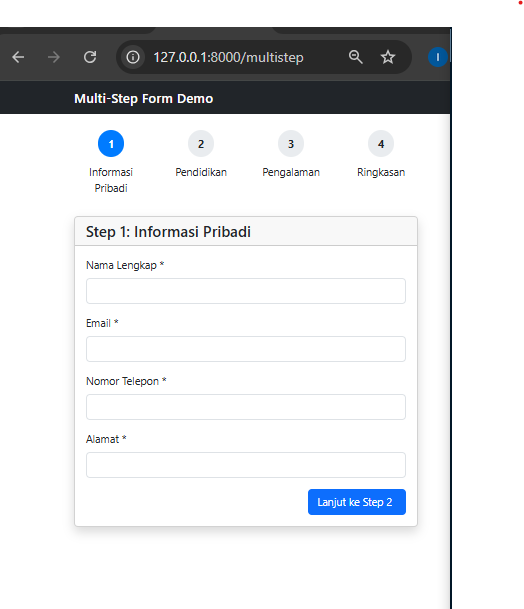
        - Lakukan percobaan seperti dibawah untuk mengetest aturan dan definisi yang digunakan di kode program:
            - Step 1: Isi informasi pribadi (nama, email, telepon, alamat)
            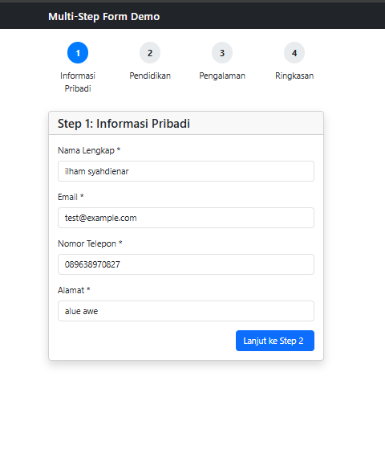
            - Step 2: Isi informasi pendidikan (tingkat = pendidikan, institusi, tahun lulus, jurusan)
            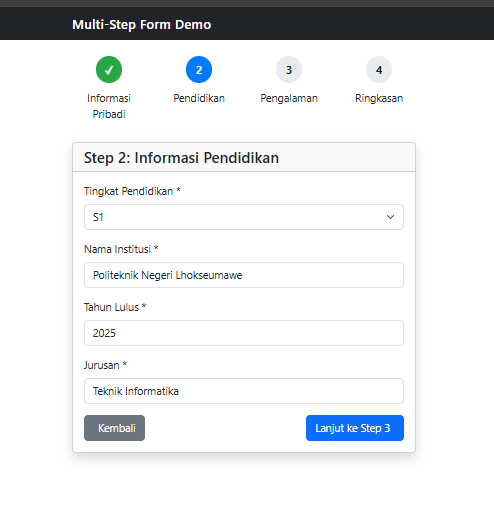
            - Step 3: Isi pengalaman kerja (pekerjaan saat ini, perusahaan, pengalaman, keahlian)
            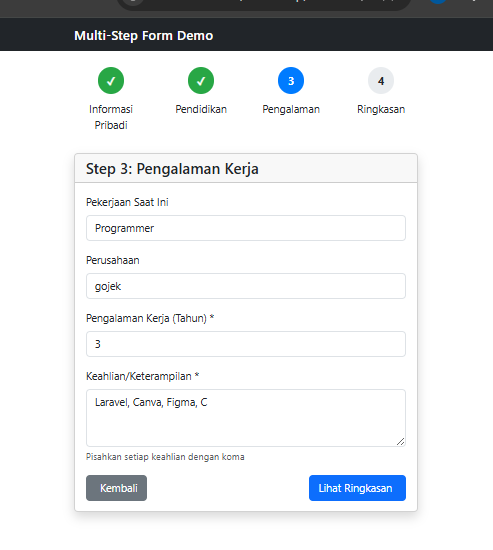
            - Summary: Lihat ringkasan data dan konfirmasi
            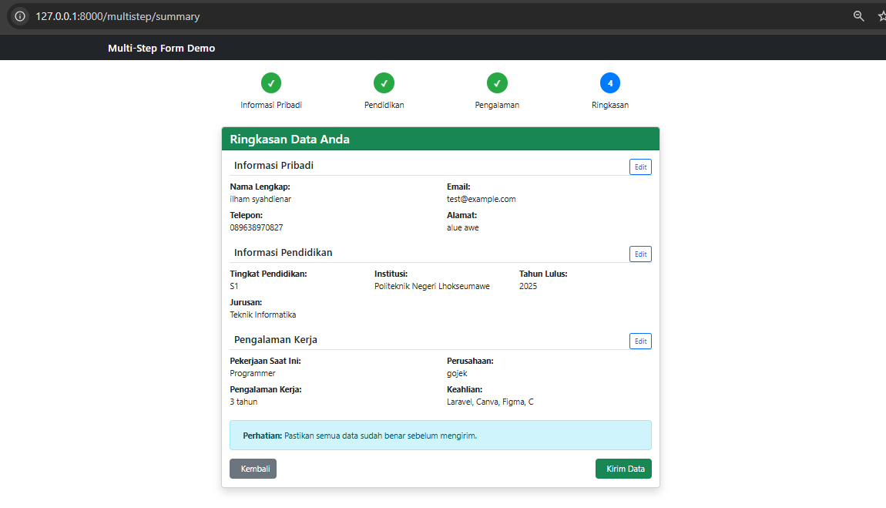
            - Complete: Tampilan sukses   
            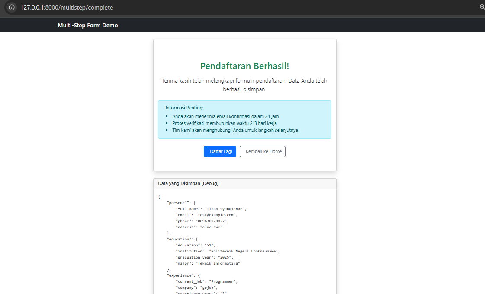

        - Dapat dilihat bahwa input data dari step 1 hingga step 3 akan terlihat di step summary dimana kita masih bisa mengedit data dari step 1 hingga step 3, lalu saat di tahap complete, kita dapat melihat data yang sudah diinput ke sebuah format database, lalu kita juga dapat kembali ke home atau mencoba daftar kembali.
        


---

## 3. Hasil dan Pembahasan
- Apakah aplikasi berjalan sesuai harapan?
    - Alhamdulillah hasil dari praktikum ini sesuai harapan meskipun menjumpai beberapa error yang disebabkan karena terlalu terburu-buru sehingga beberapa kali typo.
- Bagaimana cara kerja Form Submission di Laravel?
    - Proses form submission dimulai ketika pengguna mengisi form dan menekan tombol submit. Browser akan mengirimkan request ke route yang ditentukan menggunakan method seperti POST, PUT/PATCH, atau DELETE. Middleware Laravel kemudian memproses request tersebut, termasuk verifikasi CSRF token untuk memastikan keamanan dari serangan Cross-Site Request Forgery. Setelah itu, controller menerima data, melakukan validasi sesuai rules yang telah ditentukan, dan jika valid, data akan disimpan ke database atau diproses lebih lanjut. Jika tidak valid, pengguna akan menerima pesan error yang relevan.
- Bagaimana penerapan CSRF di Laravel?
    - Laravel secara otomatis menyertakan proteksi CSRF pada setiap form menggunakan @csrf. Token ini memastikan bahwa setiap permintaan form berasal dari sumber yang sah (bukan dari situs lain yang mencoba melakukan serangan). Jika token tidak cocok, Laravel akan menolak request tersebut.
- Bagaimana penerapan Validasi Data di Laravel?
    - Validasi data dilakukan menggunakan method $request->validate() di dalam controller. Berbagai aturan seperti required, email, max, unique, dan confirmed diterapkan agar data yang diterima sesuai dengan ketentuan tabel database. Laravel juga memungkinkan penggunaan validasi kustom dan pesan error khusus untuk memperjelas instruksi kepada pengguna.Contohnya:
    ```
    $request->validate([
        'name' => 'required|string|max:100',
        'email' => 'required|email|unique:users,email',
        'password' => 'required|confirmed|min:8'
    ]);

- Bagaimana implementasi Multi-Step Form?
    - Pada praktikum terakhir, form dibagi menjadi beberapa tahap dengan bantuan Session untuk menyimpan data sementara. Hal ini memungkinkan pengguna melanjutkan pengisian tanpa kehilangan data dari langkah sebelumnya. Sistem juga dilengkapi dengan progress bar dan tombol navigasi antar langkah agar pengalaman pengguna lebih terarah dan tidak membingungkan.

---

## 4. Kesimpulan
- Kesimpulan dari praktikum ini adalah bahwa framework Laravel sangat baik untuk menangani proses form submission dengan aman, efisien, dan terstruktur. Melalui penggunaan berbagai HTTP methods seperti POST, PUT/PATCH, dan DELETE, proses pengiriman data dapat dilakukan dengan cara yang sesuai dengan kebutuhan aplikasi. Laravel juga memiliki sistem CSRF yaitu protection bawaan yang melindungi aplikasi dari serangan Cross-Site Request Forgery dengan memastikan setiap permintaan berasal dari sumber yang sah. Selain itu, fitur validasi data di Laravel membantu memastikan bahwa input pengguna sesuai dengan aturan dan ketentuan yang berlaku, baik dari sisi format, tipe data, maupun kesesuaian dengan tabel di database. Praktikum ini juga menunjukkan bagaimana validasi kustom dan pesan error spesifik dapat meningkatkan kejelasan komunikasi dengan pengguna. Implementasi multi-step form menegaskan fleksibilitas Laravel dalam mengelola data yang dikumpulkan secara bertahap menggunakan session, sehingga proses input menjadi lebih teratur dan tidak membingungkan. Secara keseluruhan, praktikum ini berhasil memperlihatkan bagaimana Laravel dapat digunakan untuk membangun sistem form yang aman, interaktif, dan user-friendly, sekaligus menjaga kualitas serta keamanan data yang diproses.

---

## 5. Referensi
- https://medium.com/dotlocal/belajar-laravel-chapter-13-tutorial-csrf-protection-8ce2f82c4ce
- https://hackmd.io/@mohdrzu/HJWzYp7Reg
- https://buildwithangga.com/tips/belajar-validasi-laravel-dan-50-contoh-validasi-pada-projek-nyata